## **Emby** **是什么？**[​](https://web.archive.org/web/20230605003808/https:/embywiki.911997.xyz/docs/base/introduction/#emby-%E6%98%AF%E4%BB%80%E4%B9%88)

[Emby](https://web.archive.org/web/20230605003808/https:/emby.media/) 是一个家庭媒体库软件，包含服务端和客户端。服务端用于整理电影和剧集，客户端连上服务端后就能播放这些影片。

## **关于本** **Emby** **公益服**[​](https://web.archive.org/web/20230605003808/https:/embywiki.911997.xyz/docs/base/introduction/#%E5%85%B3%E4%BA%8E%E6%9C%AC-emby-%E5%85%AC%E7%9B%8A%E6%9C%8D)

本 Emby 公益服是一个免费影视媒体库，让你免去自己购买 NAS 或服务器来下载、整理、刮削影片等诸多麻烦的流程，只需要用 Emby 客户端连上 Emby 公益服务器即可在各种设备上观影。

## **承诺**[​](https://web.archive.org/web/20230605003808/https:/embywiki.911997.xyz/docs/base/introduction/#%E6%89%BF%E8%AF%BA)

**公益服永不收费！公益服永不收费！公益服永不收费！**

## **入群须知**[​](https://web.archive.org/web/20230605003808/https:/embywiki.911997.xyz/docs/base/introduction/#%E5%85%A5%E7%BE%A4%E9%A1%BB%E7%9F%A5)

*   群内严禁出现任何形式的广告，包括但不限于 ID、暗示、频道、AFF 链接等；
*   群内禁止讨论 Emby 收费服以及 机场；
*   为了公益服长久发展，请勿在任何场合展示、露出本站的 Emby 链接，账号亦仅限个人使用；
*   在群内发问前请先确认自己的问题在本 Wiki 中无法找到答案，否则你可能会被踢出去；
*   公益服没有客服，不提供技术支持，也不接受任何赞助。

# **关于考核**[​](https://web.archive.org/web/20230605003155/https:/embywiki.911997.xyz/docs/base/about-exam/#%E5%85%B3%E4%BA%8E%E8%80%83%E6%A0%B8)

**通过考核是获取账号的前提条件。**

## **考核的目的**[​](https://web.archive.org/web/20230605003155/https:/embywiki.911997.xyz/docs/base/about-exam/#%E8%80%83%E6%A0%B8%E7%9A%84%E7%9B%AE%E7%9A%84)

本 Emby 公益服要求考核是为了：

1.  让用户了解 Emby 和 Emby 公益服的基本使用方法；
2.  让群里的技术交流变得更为高效和有意义，而非机械性地重复回答基础问题；
3.  确保用户在遇到问题时有寻求解决方法的基本能力；
4.  阻止机器人抢注和贩卖账号的牟利者，尽量让有需求的人获得使用资格。

**_如果你看到这里已经觉得很麻烦，欢迎左转不需要考核的其它公益服，或者订阅爱腾优奈的会员。_**[​](https://web.archive.org/web/20230605003155/https:/embywiki.911997.xyz/docs/base/about-exam/#%E5%A6%82%E6%9E%9C%E4%BD%A0%E7%9C%8B%E5%88%B0%E8%BF%99%E9%87%8C%E5%B7%B2%E7%BB%8F%E8%A7%89%E5%BE%97%E5%BE%88%E9%BA%BB%E7%83%A6-%E6%AC%A2%E8%BF%8E%E5%B7%A6%E8%BD%AC%E4%B8%8D%E9%9C%80%E8%A6%81%E8%80%83%E6%A0%B8%E7%9A%84%E5%85%B6%E5%AE%83%E5%85%AC%E7%9B%8A%E6%9C%8D-%E6%88%96%E8%80%85%E8%AE%A2%E9%98%85%E7%88%B1%E8%85%BE%E4%BC%98%E5%A5%88%E7%9A%84%E4%BC%9A%E5%91%98%E3%80%82)

## **考核前的须知**[​](https://web.archive.org/web/20230605003155/https:/embywiki.911997.xyz/docs/base/about-exam/#%E8%80%83%E6%A0%B8%E5%89%8D%E7%9A%84%E9%A1%BB%E7%9F%A5)

*   **每次**考试需要有足够的 _每日签到_ 积分，_积分_ 和每次考试所需的 _积分要求_ 都可以通过 **厂妹** **Bot** [@EmbyPublicBot](https://web.archive.org/web/20230605003155/https:/t.me/EmbyPublicBot) 进行获取。
*   积分**仅**可以通过 _每日签到_ 获取，每日随机获得 1-5 分。
*   考试开始前请自行测试厂妹 Bot 有否出现响应缓慢等状况，否则有可能会影响你无法按时完成考试。
*   考试正式开始后（即点击 **开始** 按钮后），即扣除所需积分并不会返还。开始考试前请确认准备充足且不会有其他因素影响考试。
*   如果发送 /exam 命令无法开始考试，请尝试发送 /cancel 后再次发送 /exam 。依旧无反应则说明题库正在维护，请关注并等待群公告通知。
*   如果题目有问题，请截图私信 [管理员](https://web.archive.org/web/20230605003155/https:/t.me/marioplumber) 告知。
*   严禁在群内或其它公开场合讨论题目或索要答案。这会被视为泄题行为，管理员可以直接 ban，并删除相关消息。

## **考核的范围**[​](https://web.archive.org/web/20230605003155/https:/embywiki.911997.xyz/docs/base/about-exam/#%E8%80%83%E6%A0%B8%E7%9A%84%E8%8C%83%E5%9B%B4)

考核内容包括

*   [白嫖手册 Wiki](https://web.archive.org/web/20230605003155/https:/embywiki.911997.xyz/)
*   [提问的智慧](https://web.archive.org/web/20230605003155/https:/github.com/ryanhanwu/How-To-Ask-Questions-The-Smart-Way/blob/main/README-zh_CN.md)
*   群置顶资讯和通过简单搜索 (例如 [Google](https://web.archive.org/web/20230605003155/https:/www.google.com/)) 可获得答案的题目。

题目从题库里 **随机** 选择，所以每次考核的题目基本不一样。

_注：没有复习用的题库。考核是手段，不是目的。_

## **考核的形式**[​](https://web.archive.org/web/20230605003155/https:/embywiki.911997.xyz/docs/base/about-exam/#%E8%80%83%E6%A0%B8%E7%9A%84%E5%BD%A2%E5%BC%8F)

*   考核内容为 40 题单选题，每题 2.5 分，最终得分 90 分（即正确 36 题）或以上者通过考核。
*   考核需要在 20 分钟内完成。
*   未通过考核者可以在 72 小时后再次尝试考核。

_注_ _1__：由于机器人不显示小数点，所以会出现__93__分这种分数，实际分数其实是__92.5__分。_

_注_ _2__：考核结束时若显示花费__20__分钟，即花费了__20__分钟以上__21__分钟以下的时间，实质上仍为超时。_

## **如何考核**[​](https://web.archive.org/web/20230605003155/https:/embywiki.911997.xyz/docs/base/about-exam/#%E5%A6%82%E4%BD%95%E8%80%83%E6%A0%B8)

*   请向 **厂妹** [@EmbyPublicBot](https://web.archive.org/web/20230605003155/https:/t.me/EmbyPublicBot) 私聊，发送 /exam 命令。

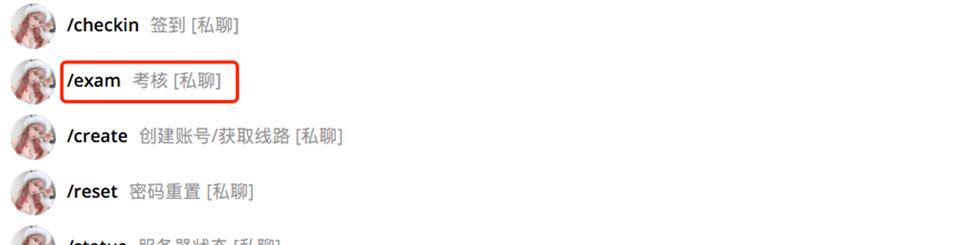

_注：如果发送命令后没反应，请先发送_ _/cancel_ _后再尝试。这是_ _Telegram_ _机器人的_ _bug__。_

*   根据提示，点击**开始**，即可开始考试。

_注：如果没有看到**开始**按钮，请先发送_ _/cancel_ _后再尝试更换客户端考试。_

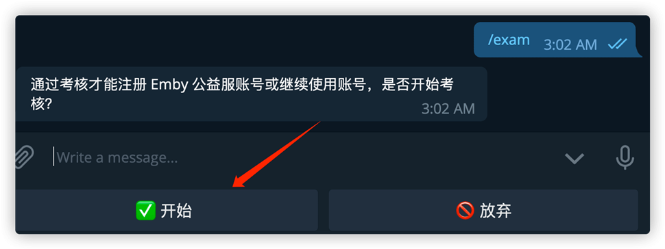

*   若考核通过会显示获得注册资格，在服务器开放注册期间即可 ** [创建账号](https://web.archive.org/web/20230605003155/https:/embywiki.911997.xyz/docs/base/create-account/index) **。

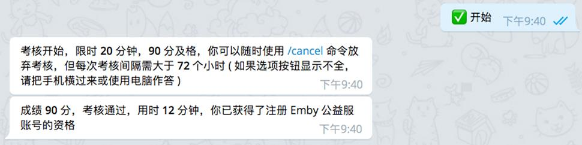

## **考核的界面**[​](https://web.archive.org/web/20230605003155/https:/embywiki.911997.xyz/docs/base/about-exam/#%E8%80%83%E6%A0%B8%E7%9A%84%E7%95%8C%E9%9D%A2)

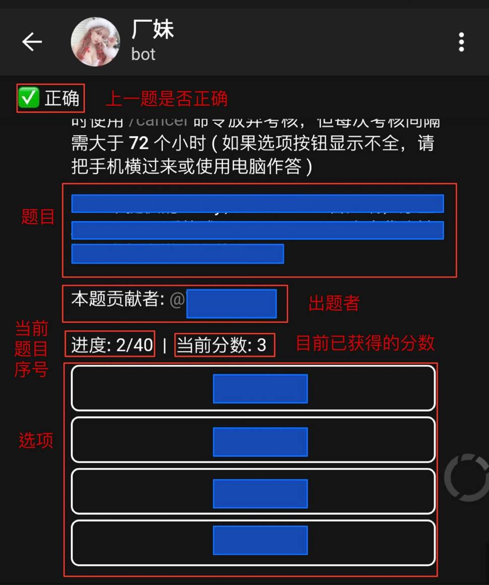

## **来自满分大佬们的心得：**[​](https://web.archive.org/web/20230605003155/https:/embywiki.911997.xyz/docs/base/about-exam/#%E6%9D%A5%E8%87%AA%E6%BB%A1%E5%88%86%E5%A4%A7%E4%BD%AC%E4%BB%AC%E7%9A%84%E5%BF%83%E5%BE%97)

*   考试前请先仔细阅读[白嫖手册 wiki](https://web.archive.org/web/20230605003155/https:/embywiki.911997.xyz/)
*   题目不会根据你的需求和使用环境调整，所以即使你认为某部分你用不到，也先了解大概内容，并在遇到相关题目的时候知道如何查找。
*   请先阅读一次[提问的智慧](https://web.archive.org/web/20230605003155/https:/github.com/ryanhanwu/How-To-Ask-Questions-The-Smart-Way/blob/main/README-zh_CN.md)，理解里面的原则。 这对你以后在群里的讨论和互动也有帮助。
*   考核是开卷的形式，部分问题需要上网搜索获取答案（除非你有广泛的知识背景）。
*   请仔细阅读题目，确保你没有理解错误。
*   考核时间为 20 分钟，只要了解考核内容，时间相当充分。如果遇到不确定的问题请花时间思考和上网查证。请自行准备计时工具以防超时。
*   即使你这次已经因为过多错误无法通过考核，继续答题仍然对你下次考核有所帮助。

## **来自被放逐者的教训**[​](https://web.archive.org/web/20230605003155/https:/embywiki.911997.xyz/docs/base/about-exam/#%E6%9D%A5%E8%87%AA%E8%A2%AB%E6%94%BE%E9%80%90%E8%80%85%E7%9A%84%E6%95%99%E8%AE%AD)

以下行为或发言可能会导致你被警告或直接封禁账号：

*   在任何地方（包括公益服讨论群）公开泄露或讨论考题。

A：题库采纳的考题已经过水管工审查。如果对考题有异议，请私聊水管工。

*    为什么要考试？这是耍猴吗？

A：考核的目的请参考本页相关条目。

*    考试太难了。分数要求太高。

A：目前群里已经有超过 1 万人成功注册，所以通过考核并非无法企及的目标。_(__话说你当年读书的时候会跟老师要求降低及格线吗？__)_

*    我根本不会用 XX，为什么要问我这种问题？

A：题目不会根据你的需求和使用环境调整。其他用户可能也不使用你在使用的设备。

*    这种问题根本和 Emby/ 考核范围没关系。

A：此类问题的目的在于考核你的搜索能力。这符合 [提问的智慧](https://web.archive.org/web/20230605003155/https:/github.com/ryanhanwu/How-To-Ask-Questions-The-Smart-Way/blob/main/README-zh_CN.md) 里面的原则。

*    怎么注册？怎么考试？不会。

A：………………

**_如果你看到这里还是觉得很麻烦，请不要犹豫，本服务器可能并不适合不喜欢折腾的你。_**[​](https://web.archive.org/web/20230605003155/https:/embywiki.911997.xyz/docs/base/about-exam/#%E5%A6%82%E6%9E%9C%E4%BD%A0%E7%9C%8B%E5%88%B0%E8%BF%99%E9%87%8C%E8%BF%98%E6%98%AF%E8%A7%89%E5%BE%97%E5%BE%88%E9%BA%BB%E7%83%A6-%E8%AF%B7%E4%B8%8D%E8%A6%81%E7%8A%B9%E8%B1%AB-%E6%9C%AC%E6%9C%8D%E5%8A%A1%E5%99%A8%E5%8F%AF%E8%83%BD%E5%B9%B6%E4%B8%8D%E9%80%82%E5%90%88%E4%B8%8D%E5%96%9C%E6%AC%A2%E6%8A%98%E8%85%BE%E7%9A%84%E4%BD%A0%E3%80%82)

**_欢迎左转去往不需要考核的其它公益服，或者订阅爱腾优奈的会员。_**[​](https://web.archive.org/web/20230605003155/https:/embywiki.911997.xyz/docs/base/about-exam/#%E6%AC%A2%E8%BF%8E%E5%B7%A6%E8%BD%AC%E5%8E%BB%E5%BE%80%E4%B8%8D%E9%9C%80%E8%A6%81%E8%80%83%E6%A0%B8%E7%9A%84%E5%85%B6%E5%AE%83%E5%85%AC%E7%9B%8A%E6%9C%8D-%E6%88%96%E8%80%85%E8%AE%A2%E9%98%85%E7%88%B1%E8%85%BE%E4%BC%98%E5%A5%88%E7%9A%84%E4%BC%9A%E5%91%98%E3%80%82)

**考核通过后的注意事项**[​](https://web.archive.org/web/20230605003155/https:/embywiki.911997.xyz/docs/base/about-exam/#%E8%80%83%E6%A0%B8%E9%80%9A%E8%BF%87%E5%90%8E%E7%9A%84%E6%B3%A8%E6%84%8F%E4%BA%8B%E9%A1%B9)

假设你考试通过了，那么还需要注意...

*   考试通过 **不等于** 可以立即 [创建账号](https://web.archive.org/web/20230605003155/https:/embywiki.911997.xyz/docs/base/create-account/index)，需等待水管工开启注册（开启时间随缘，大家需时常关注终点站的 [群组](https://web.archive.org/web/20230605003155/https:/t.me/EmbyPublic) 和 [频道](https://web.archive.org/web/20230605003155/https:/t.me/embypub)）。
*   账号有效期从考试通过起 +365 天，并非从获得账号起计算。
*   账号过期前 **60** **天**内，可以通过考核延长账号有效期（此考试依然需要签到积分），或者在厂妹 Bot 使用 /renew 重置有效期（需要 500 签到积分）。
*   通过考核延长或使用 /renew 重置的账号有效期为当前时间 +365 天，此操作有效期不可叠加。
*   延长账号有效期的考核未通过时，账号的有效期保持不变，账号在有效期内仍能使用。
*   如果账号过期前未通过考核延长使用期限，Emby 账号会被[封禁](https://web.archive.org/web/20230605003155/https:/embywiki.911997.xyz/docs/base/ban-track/index)。若要继续使用本 Emby 服务器则需要在厂妹 Bot 使用 /rebirth 解除封禁并重置有效期为 365 天（需要 1000 签到积分）。

# **创建账号**[​](https://web.archive.org/web/20230605002713/https:/embywiki.911997.xyz/docs/base/create-account/#%E5%88%9B%E5%BB%BA%E8%B4%A6%E5%8F%B7)

**重要：请确保你已经阅读** [关于考核](https://web.archive.org/web/20230605002713/https:/embywiki.911997.xyz/docs/base/about-exam/index) **一节。**

Emby 公益服可以为每人提供一个独立账号，这样就不存在大家使用相同账号导致播放记录一片混乱的情况。

**创建账号**[​](https://web.archive.org/web/20230605002713/https:/embywiki.911997.xyz/docs/base/create-account/#%E5%88%9B%E5%BB%BA%E8%B4%A6%E5%8F%B7-1)

首先你需要是 [Telegram](https://web.archive.org/web/20230605002713/https:/telegram.org/) 用户，才能继续。

1.  加入 Emby 公益服 Telegram 群

 Emby 公益服 Telegram 群地址：[https://t.me/EmbyPublic](https://web.archive.org/web/20230605002713/https:/t.me/EmbyPublic)

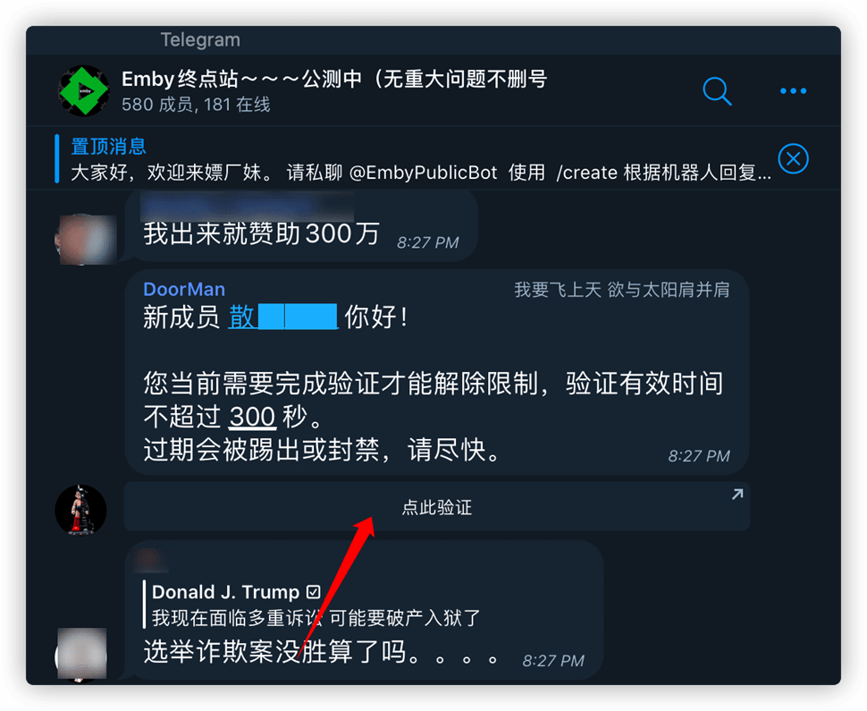

 加群后请立即点击箭头所指的按钮私聊进群验证机器人回答一个问题，回答正确才算正式入群，回答错误会被机器人踢出群，但别慌，两分钟后可以重新加群再次挑战。

2.  阅读群内须知

 正式进群后确保将入群时提示的列表内的内容全都浏览一遍。如果入群时没有注意错过了，或者将来想要复习，可以在群组内输入 help 进行查看。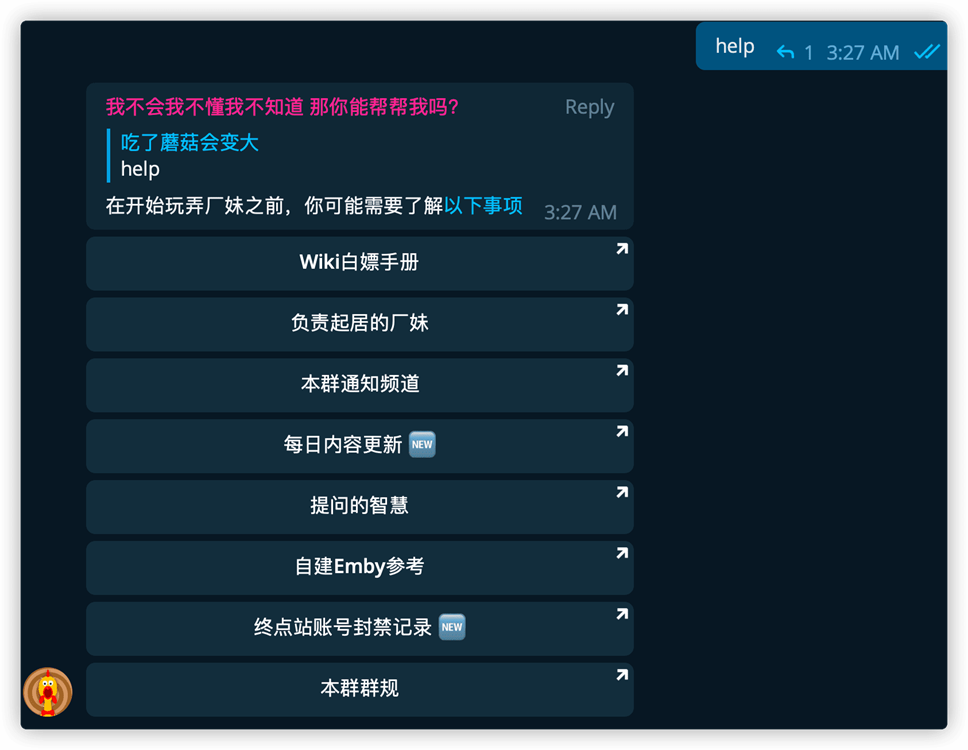

3.  积攒签到积分，并通过[考核](https://web.archive.org/web/20230605002713/https:/embywiki.911997.xyz/docs/base/about-exam/index)

 签到和考核可通过私聊厂妹机器人 [@EmbyPublicBot](https://web.archive.org/web/20230605002713/https:/t.me/EmbyPublicBot) 进行。如果未通过考核，即使开放注册了也无法注册账号。

4.  在**开放注册期间**创建账号

 私聊厂妹机器人 [@EmbyPublicBot](https://web.archive.org/web/20230605002713/https:/t.me/EmbyPublicBot) ，使用 /create 命令创建账号。

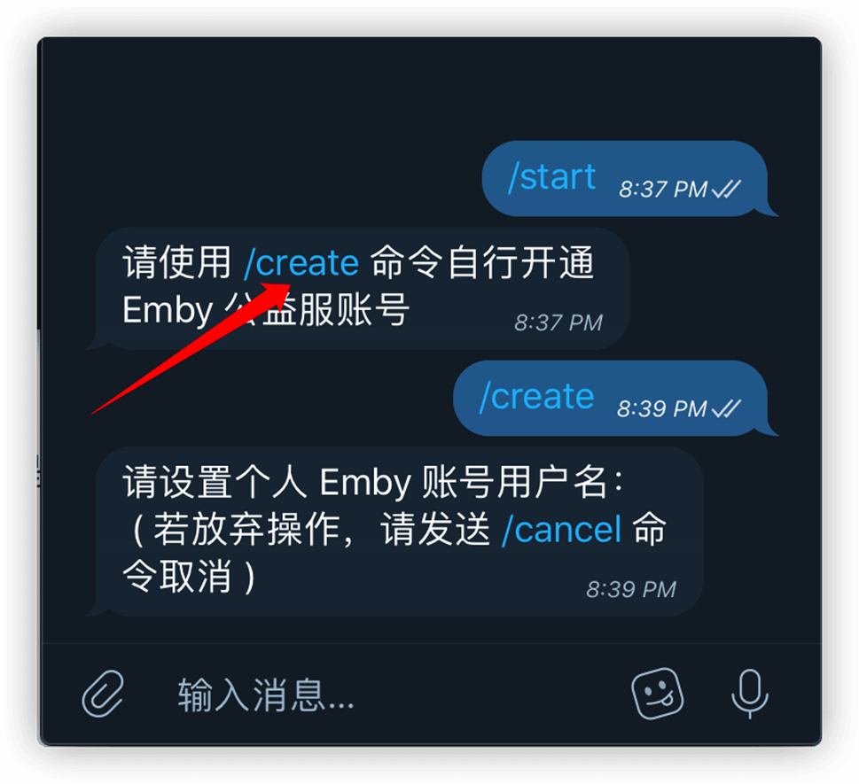

 发送 /create 后厂妹会让我们设置自己的 Emby 公益服账号用户名。_请勿重复发送命令，否则可能影响你正常注册。_

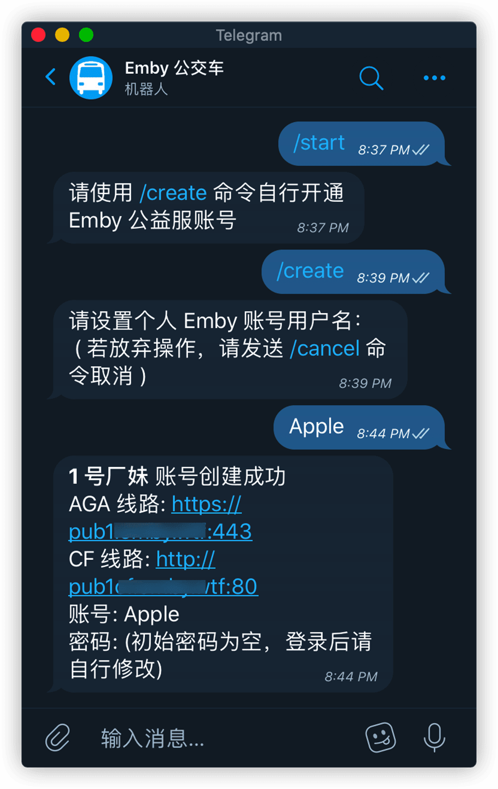

 在下面输入自己要取的用户名并发给机器人 ( 我取的账号名叫 Apple )，它就会为你注册一个公益服的账号并给你公益服的地址和端口（地址冒号后面就是端口号，在再设置客户端连接的时候需要用到）。

 _注：注册成功后请勿退群，否则_ _Emby_ _账号会被禁用。不小心退群的话请尽快重新加群。_

# **修改密码**[​](https://web.archive.org/web/20230605002713/https:/embywiki.911997.xyz/docs/base/create-account/#%E4%BF%AE%E6%94%B9%E5%AF%86%E7%A0%81)

现在新注册的账号已附有一个随机的初始密码。

由于刚才注册的用户名叫 Apple ，有点太普通了，万一被人猜到用户名和密码并登录看片，那我的播放记录不就乱了？所以还得赶紧去改个密码。用浏览器打开上面的链接，点 **手动登录**。

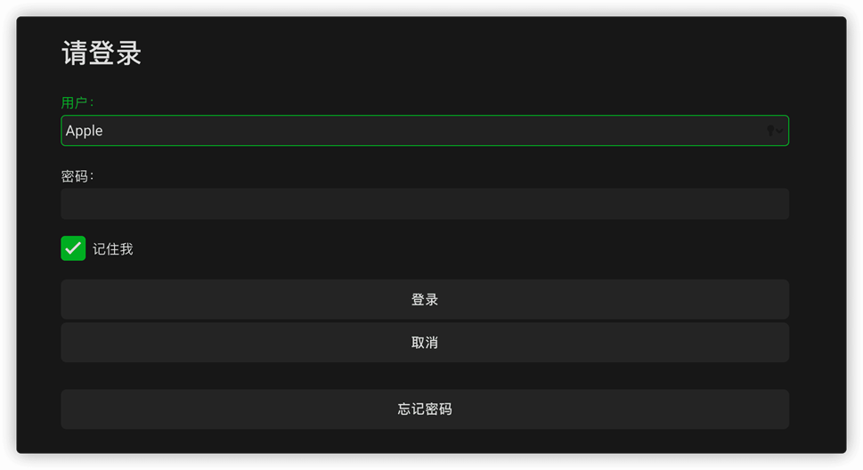

填上用户名和初始密码，点 **登录**

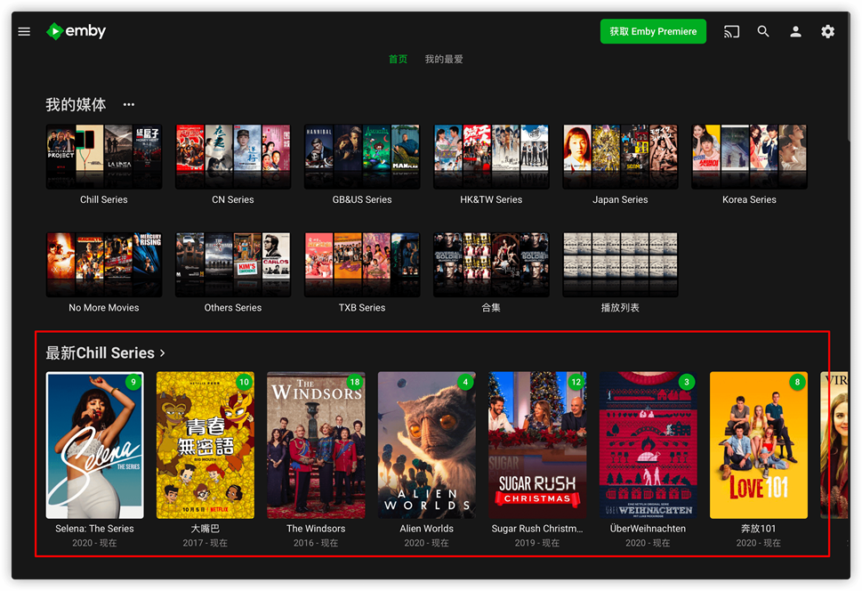

进去后我红框框住的那一排 Netflix 最新的剧集就映入眼帘了，美滋滋。但是别忘了我们是来干嘛的，是来改密码的。

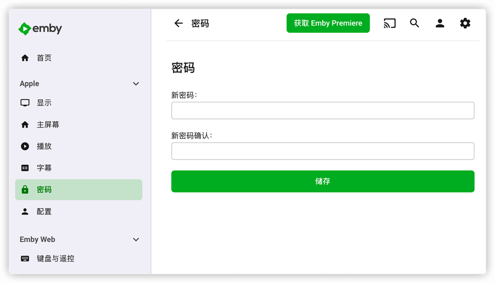

点击右上角的小人图标，打开设置页面就可以修改密码了。

Emby 公益服已提供高可用线路，会根据使用者的网络提供合适的线路。另外，万一出现线路暴毙的情况，会主动切换到后备线路。

每台服务器目前各提供一条高可用线路。

_之后也许会根据大家的使用情况随时_**_新增_**_或_**_删减_**_服务器与中转线路，请以实际获取为准。_

私聊这个机器人 [@EmbyPublicBot](https://web.archive.org/web/20230605003120/https:/t.me/EmbyPublicBot) 使用 `/create` 命令获取。

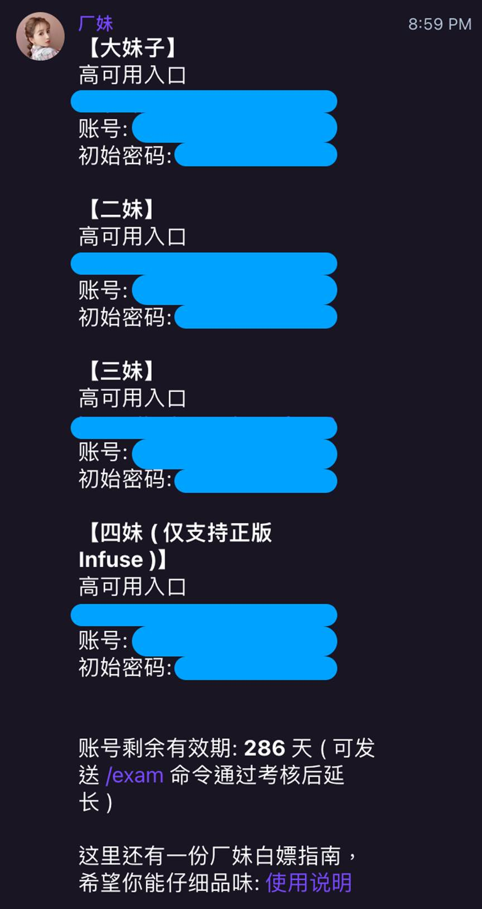

_注：如果直连情况下观看体验不佳，可以尝试使用代理观看。_

通过查看服务器状态来选择负载较低的服务器，以获得更好的观影体验。

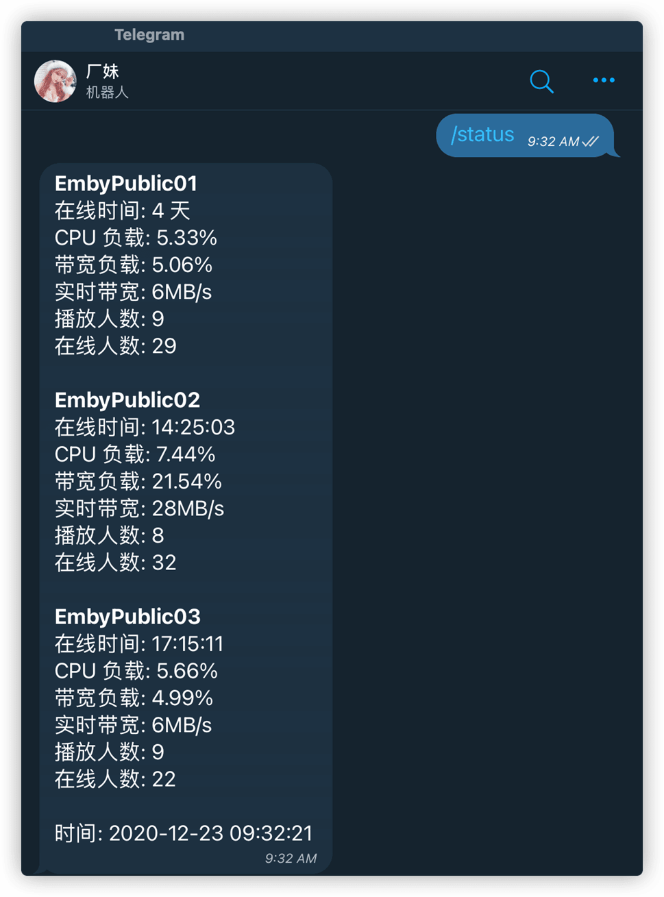

使用 `/status` 命令查看服务器状态

正常情况下，修改密码只需要在 Emby 客户端上修改即可。

但有的时候，由于一些不知道什么原因的原因，密码丢失了，则可以通过机器人 [@EmbyPublicBot](https://web.archive.org/web/20230604230237/https:/t.me/EmbyPublicBot) 重置密码。

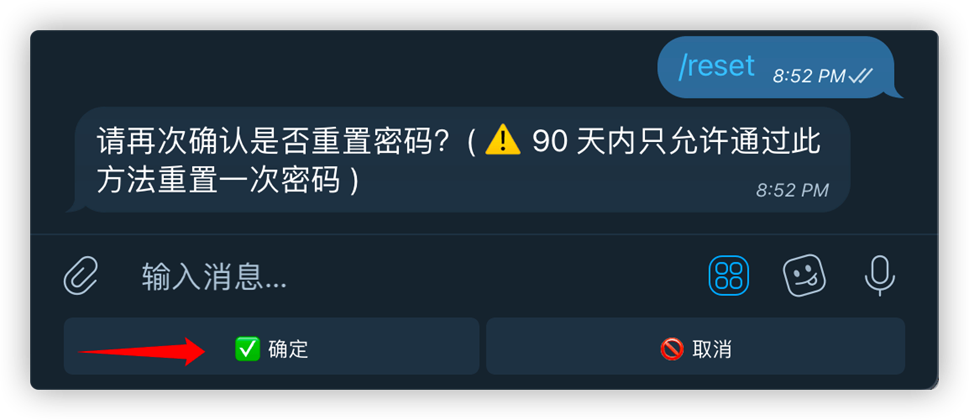

发送 `/reset` 命令后确认是否重置密码

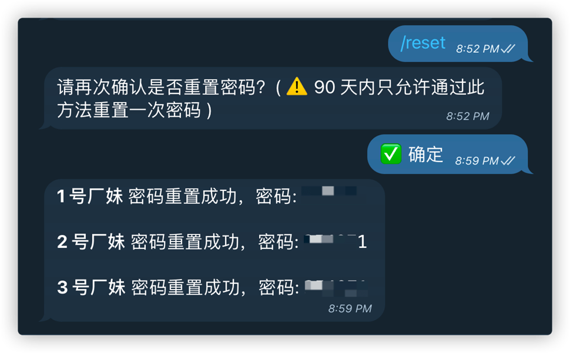

点击 **✅** **确定** 按钮，会把所有 Emby 服务器上你的账号密码给重置

Emby 公益服的每台服务器都是相互独立的，修改某台服务器上的密码后并不会同步到其他服务器上去，需要自己手动修改。

# **重考规则**[​](https://web.archive.org/web/20230604230921/https:/embywiki.911997.xyz/docs/base/re-sit/#%E9%87%8D%E8%80%83%E8%A7%84%E5%88%99)

**重考主要用于防范账号交易，同时也警示长期未阅读** **Wiki** **的用户能够及时温故而知新**[​](https://web.archive.org/web/20230604230921/https:/embywiki.911997.xyz/docs/base/re-sit/#%E9%87%8D%E8%80%83%E4%B8%BB%E8%A6%81%E7%94%A8%E4%BA%8E%E9%98%B2%E8%8C%83%E8%B4%A6%E5%8F%B7%E4%BA%A4%E6%98%93-%E5%90%8C%E6%97%B6%E4%B9%9F%E8%AD%A6%E7%A4%BA%E9%95%BF%E6%9C%9F%E6%9C%AA%E9%98%85%E8%AF%BBwiki%E7%9A%84%E7%94%A8%E6%88%B7%E8%83%BD%E5%A4%9F%E5%8F%8A%E6%97%B6%E6%B8%A9%E6%95%85%E8%80%8C%E7%9F%A5%E6%96%B0)

*   重考规则适用于 **所有** 已经通过考试，并已经拥有有效终点站账户之用户
*   使用者在 [终点站群组](https://web.archive.org/web/20230604230921/https:/t.me/EmbyPublic) 内提出本 Wiki 中涉及并已给出解决方案的问题，管理员有权对其发出重考要求
*   被要求 **重考** 的用户会在 [厂妹](https://web.archive.org/web/20230604230921/https:/t.me/EmbyPublicBot) 对话中获得提示

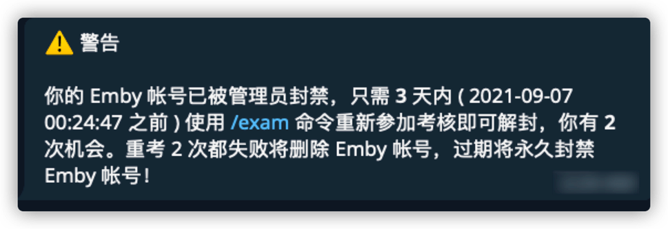

*   获得 **重考** 提示的用户会被即刻禁用账户，直至重考通过
*   获得 **重考** 提示的用户可以在收到提示后的规定时间内，通过 [厂妹](https://web.archive.org/web/20230604230921/https:/t.me/EmbyPublicBot) 考试命令，参加重考。考试相关事项请参考 [关于考试](https://web.archive.org/web/20230604230921/https:/embywiki.911997.xyz/docs/base/about-exam/index)
*   在规定时间内使用系统给予的重考次数，无需交纳报名分（签到积分）
*   系统给予的重考次数皆未及格，系统立即删除账号，需要重新使用积分参加考试，等待注册开启时重新注册账号
*   在规定时间内未参加考试，或在考试未及格的情况下没有将系统给予的重考次数使用完，原有终点站账号将被永久封禁
*   重考及格**不会**延长帐号有效期

**~区域限制~**[​](https://web.archive.org/web/20230604231357/https:/embywiki.911997.xyz/docs/base/faq/#%E5%8C%BA%E5%9F%9F%E9%99%90%E5%88%B6)

~仅限~ **~中国大陆及港澳台~**~、**日本**、**韩国**、**新加坡**、**澳大利亚**、**新西兰**~ ~的~ ~IP~ ~访问。~~(~ ~使用~ ~GCP~ ~自建梯子的基本都是美国广播~ ~IP~~，这些可能不能访问~ ~)~

# 关于线路[​](https://web.archive.org/web/20230604231357/https:/embywiki.911997.xyz/docs/base/faq/#%E5%85%B3%E4%BA%8E%E7%BA%BF%E8%B7%AF)

终点站提供全球高可用入口，但由于国内网络环境十分复杂，不同地区不同运营商观看体验大相径庭，请自行测试连接情况。若出现 **直连** 卡顿、无法播放等情况，请 **挂上梯子** 后再试试。如果都不行那就没办法了，毕竟不是开机场的，无法提供各种国内中转线路。

注：1. 请自行确认梯子是否生效。 2. 梯子是否适用以实际体验为准。YouTube 跑分几十万  没有任何意义，终点站毕竟没有全球 CDN。

关于客户端选择[​](https://web.archive.org/web/20230604231357/https:/embywiki.911997.xyz/docs/base/faq/#%E5%85%B3%E4%BA%8E%E5%AE%A2%E6%88%B7%E7%AB%AF%E9%80%89%E6%8B%A9)

由于 Emby 特殊的机制，以及数据库的缺陷，客户端需要使用单线程进行播放，一些魔改或野生播放器会使用无脑多线程进行连接，大量的多线程会触发 DDOS 防御机制，导致自动封禁账号。

仅推荐使用 Emby 客户端、Terminus Player 以及外链调用播放器。

本 Wiki 未列出的客户端，不保证其可用性，因使用未列出的客户端而被封禁的账号，不予以解封。

本 Wiki 具有一定的滞后性，客户端限制变动请关注 [终点站](https://web.archive.org/web/20230604231357/https:/t.me/EmbyPublic) 群组置顶。

**如果需要使用** **Infuse****，请选择四妹，其他三个妹均无法使用** **Infuse** **连接，四妹也无法使用其他客户端连接。**

# 其他常见问题

**没有兼容的流**[​](https://web.archive.org/web/20230604231357/https:/embywiki.911997.xyz/docs/base/faq/#%E6%B2%A1%E6%9C%89%E5%85%BC%E5%AE%B9%E7%9A%84%E6%B5%81)

播放时提示 **没有兼容的流** 的原因很多，主要为以下几种情况：

·        网络卡顿

与服务器连接缓慢，导致在缓存时间内无法加载到足够的内容导致无法播放，需要为 Emby 客户端或第三方播放器挂上梯子，请参考 [备用 Wiki](https://web.archive.org/web/20230604231357/https:/howtogayemby.911997.xyz/) 中 **进阶使用**。

·        通过浏览器访问网页播放

在网页上播放提示 **** **没有兼容的流** **** 、 **有声音没画面** 或 **没声音有画面** 。因为**大多数浏览器** 对部分音视频格式兼容性差，请详见 [电脑浏览器播放](https://web.archive.org/web/20230604231357/https:/embywiki.911997.xyz/docs/usage/play-in-browser/index)。

**公益服收费吗？[**​](https://web.archive.org/web/20230604231357/https:/embywiki.911997.xyz/docs/base/faq/#%E5%85%AC%E7%9B%8A%E6%9C%8D%E6%94%B6%E8%B4%B9%E5%90%97)

永远免费且无广告直到倒闭。

**解锁 App 的钱去哪了？**[​](https://web.archive.org/web/20230604231357/https:/embywiki.911997.xyz/docs/base/faq/#%E8%A7%A3%E9%94%81-app-%E7%9A%84%E9%92%B1%E5%8E%BB%E5%93%AA%E4%BA%86)

iPhone/iPad/Mac 客户端上 30 元解锁正版 Emby 客户端的钱由 Emby 官方和苹果收取，公益服不收一分钱。

**Emby Premiere 和 Unlock Playback 什么区别？**[​](https://web.archive.org/web/20230604231357/https:/embywiki.911997.xyz/docs/base/faq/#emby-premiere-%E5%92%8C-unlock-playback-%E4%BB%80%E4%B9%88%E5%8C%BA%E5%88%AB)

Emby Premiere 用于服务端的高级功能解锁，为订阅制。非自行搭建服务器者请勿购买 Emby Premiere。

Unlock Playback 用于客户端播放权限解锁，为买断制。Unlock Playback 跟随账号，一个账号购买可多设备使用。

**新开的服务器账号密码是什么？**[​](https://web.archive.org/web/20230604231357/https:/embywiki.911997.xyz/docs/base/faq/#%E6%96%B0%E5%BC%80%E7%9A%84%E6%9C%8D%E5%8A%A1%E5%99%A8%E8%B4%A6%E5%8F%B7%E5%AF%86%E7%A0%81%E6%98%AF%E4%BB%80%E4%B9%88)

如果你已有 **大妹** 的账号密码，则直接使用 **大妹** 的账号密码登录新服。

如果创建账号时遇到接口异常，请尽快反馈处理。

**为什么四妹找不到 XX 影片但其他妹能找到？**[​](https://web.archive.org/web/20230604231357/https:/embywiki.911997.xyz/docs/base/faq/#%E4%B8%BA%E4%BB%80%E4%B9%88%E5%9B%9B%E5%A6%B9%E6%89%BE%E4%B8%8D%E5%88%B0xx%E5%BD%B1%E7%89%87%E4%BD%86%E5%85%B6%E4%BB%96%E5%A6%B9%E8%83%BD%E6%89%BE%E5%88%B0)

所有妹（服务器）的影片库是完全一样的。

Infuse 由于其特殊的扫库机制，在公益服影片以及剧集众多的情况下容易产生遗漏，导致搜索时会出现缺失。

重新扫描**可能**可以解决，但更建议换用其他妹通过 Emby 客户端或外链调用 Infuse 观看。

_注：如果在四妹搜索不到某影片或剧集，请先搜索一二三妹。原则上不处理四妹的影片缺失问题。_

**iOS 客户端中文字幕太小怎么办？**[​](https://web.archive.org/web/20230604231357/https:/embywiki.911997.xyz/docs/base/faq/#ios-%E5%AE%A2%E6%88%B7%E7%AB%AF%E4%B8%AD%E6%96%87%E5%AD%97%E5%B9%95%E5%A4%AA%E5%B0%8F%E6%80%8E%E4%B9%88%E5%8A%9E)

~给~ [~Emby~ ~官方反馈~](https://web.archive.org/web/20230604231357/https:/emby.media/community/index.php?/forum/94-ios/)

Emby 官方已于 2020-12-26 修复了此问题，升级到 `v2.0.2` 或更高版本即可

**播放记录不同步**[​](https://web.archive.org/web/20230604231357/https:/embywiki.911997.xyz/docs/base/faq/#%E6%92%AD%E6%94%BE%E8%AE%B0%E5%BD%95%E4%B8%8D%E5%90%8C%E6%AD%A5)

Emby 公益服的每台服务器都是相互独立的，在某台服务器上的播放记录与收藏的影片并不会同步到其他服务器上去。

**厂妹 Bot 反应很慢或无反应**[​](https://web.archive.org/web/20230604231357/https:/embywiki.911997.xyz/docs/base/faq/#%E5%8E%82%E5%A6%B9bot%E5%8F%8D%E5%BA%94%E5%BE%88%E6%85%A2%E6%88%96%E6%97%A0%E5%8F%8D%E5%BA%94)

通常是因为有大量指令被发往厂妹，常见情景为有人~调戏~攻击厂妹或者大量新用户注册时。出现此情况请耐心等待厂妹回复，切勿重复发送指令。此时发送过多指令有可能会触发厂妹的封禁机制。

当厂妹没有反应，且确定不是上述情况时（如群里没有很多人报告无法使用厂妹亦或无人触发厂妹的封禁机制），此时应该发送`/cancel`先取消当前会话，然后重新发送你需要执行的指令，比如`/checkin`签到或者`/exam`参加考试等。

**Terminus Player 反复提示更新**[​](https://web.archive.org/web/20230604231357/https:/embywiki.911997.xyz/docs/base/faq/#terminus-player%E5%8F%8D%E5%A4%8D%E6%8F%90%E7%A4%BA%E6%9B%B4%E6%96%B0)

由于 Jellyfin 上游更新了客户端，导致 Terminus player 会收到更新提示。此时请不要更新，否则使用 Emby 时会遇到功能上的不兼容，甚至会被短暂地自动封禁。如果不小心升级请卸载后重装 Terminus player。更新检测可手动关闭（见下图）。

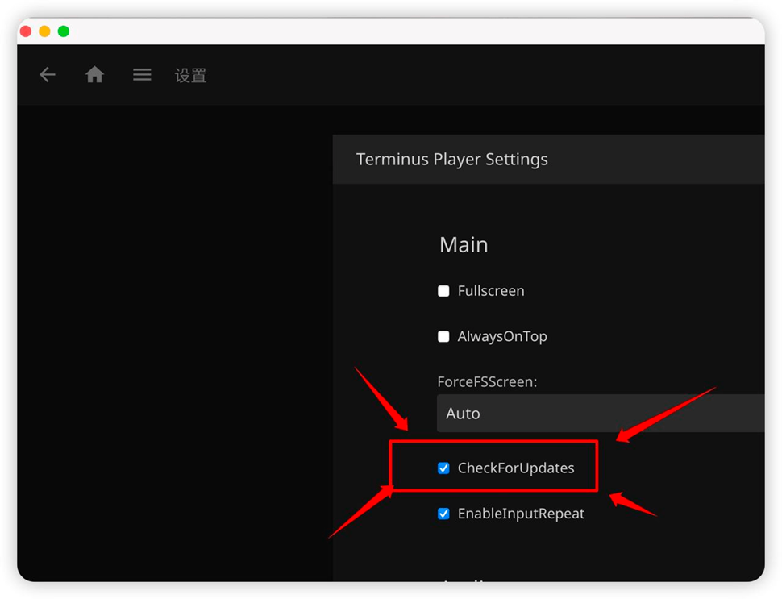

**安装 Terminus Player 时提示已安装更新的版本**[​](https://web.archive.org/web/20230604231357/https:/embywiki.911997.xyz/docs/base/faq/#%E5%AE%89%E8%A3%85-terminus-player-%E6%97%B6%E6%8F%90%E7%A4%BA%E5%B7%B2%E5%AE%89%E8%A3%85%E6%9B%B4%E6%96%B0%E7%9A%84%E7%89%88%E6%9C%AC)

Terminus Player 基于 Jellyfin 播放器，若已经 / 曾经安装新版本的 Jellyfin 播放器可能会导致无法安装 Terminus Player。如出现该提示请彻底删除 Jellyfin 播放器及相关文件。

**苹果系设备上 Emby 官方 App DTS 音源内容无法播放**[​](https://web.archive.org/web/20230604231357/https:/embywiki.911997.xyz/docs/base/faq/#%E8%8B%B9%E6%9E%9C%E7%B3%BB%E8%AE%BE%E5%A4%87%E4%B8%8A-emby-%E5%AE%98%E6%96%B9-app-dts-%E9%9F%B3%E6%BA%90%E5%86%85%E5%AE%B9%E6%97%A0%E6%B3%95%E6%92%AD%E6%94%BE)

旧版 Emby 官方 app 在苹果设备（手机、平板、电脑等）上无法解码 DTS 音源，导致播放相关内容时，无法输出对应的声音，具体表现为只有画面输出，无声音播放，部分设备会在长时间转圈加载后，输出无兼容流的错误。

可更新至最新版官方 app（电脑版需在 Emby 官网下载）或者通过外链播放解决。

**缺少影片字幕**[​](https://web.archive.org/web/20230604231357/https:/embywiki.911997.xyz/docs/base/faq/#%E7%BC%BA%E5%B0%91%E5%BD%B1%E7%89%87%E5%AD%97%E5%B9%95)

公益服影片众多，因来源不一，难免有字幕相关问题出现

·        影片缺少字幕怎么办？

使用外链调用播放器后，自行寻找字幕并在播放器内挂载观看

·        使用 Emby 观看时有字幕，但外链播放反而没有字幕？

该字幕并非内封 / 内嵌字幕，而是外挂形式，外链播放时无法读取。

遇到该情况请使用客户端或自行寻找字幕并在播放器内挂载观看

**关于意见反馈和求资源**[​](https://web.archive.org/web/20230604231357/https:/embywiki.911997.xyz/docs/base/faq/#%E5%85%B3%E4%BA%8E%E6%84%8F%E8%A7%81%E5%8F%8D%E9%A6%88%E5%92%8C%E6%B1%82%E8%B5%84%E6%BA%90)

~问题反馈进表填写~ ~欢迎多多反馈~ ~以及欢迎各路大咖们帮助解决~[~填表~ ~link~](https://web.archive.org/web/20230604231357/https:/docs.google.com/spreadsheets/d/1_ZGuvqAjU6Lw5eush1Bq7-97nU7MHwSs3P-UgvhD5Zg/edit#gid=0)

反馈求资源渠道暂时取消。

为了维护良好的交流空间和使用环境，终点站已逐步建立完善的规则系统，若违反规则可能会触发帐号被封禁。本页解释各种封禁原因以及如何避免被封禁。

**查询封禁**[​](https://web.archive.org/web/20230604230830/https:/embywiki.911997.xyz/docs/base/ban-track/#%E6%9F%A5%E8%AF%A2%E5%B0%81%E7%A6%81)

从厂妹处得知被封禁后，请前往 [封禁频道](https://web.archive.org/web/20230604230830/https:/t.me/joinchat/U7M2tqH3NKErZmP_) 查询封禁缘由。若提示私密频道，请在 [@EmbyPublic](https://web.archive.org/web/20230604230830/https:/t.me/EmbyPublic) 发送 **help**，从机器人回复的链接进入。

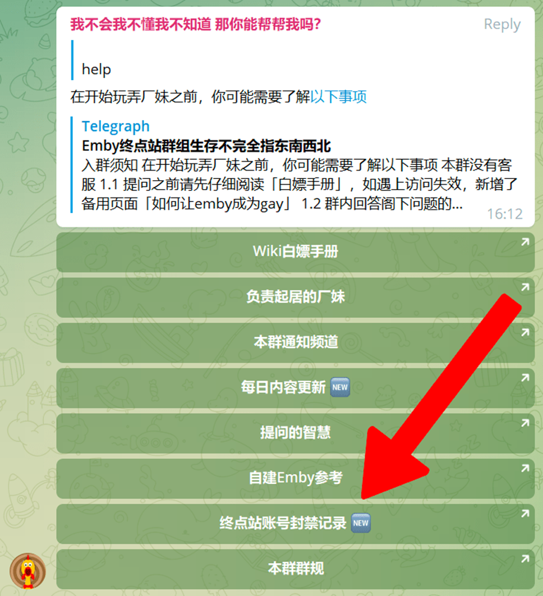

私聊 [@userinfobot](https://web.archive.org/web/20230604230830/https:/t.me/userinfobot) 这个机器人，发送 `/start` 查询自己的 tg 数字 id，然后用这个 id 在频道里搜索自己的封禁情况。

**封禁缘由解析**[​](https://web.archive.org/web/20230604230830/https:/embywiki.911997.xyz/docs/base/ban-track/#%E5%B0%81%E7%A6%81%E7%BC%98%E7%94%B1%E8%A7%A3%E6%9E%90)

·        被 ban 了或已退群

字面意思。

**避免方法**：加入群组不要退、关注频道不走丢、多和厂妹说说话、了解群规不吃亏

·        疑似攻击 xxx 服务器，如为误封，请联系管理员

常见于使用某些非寻常客户端，在播放时频繁寻求与服务器建立连接，造成攻击判定；也常见于主动 / 误使用下载器下载资源，下载器建立多线程连接，造成攻击判定。

**避免方法**：不要使用非常规客户端，尽量不要下载视频或依据 Wiki 内方法下载

·        强制重考

通过考试的情况下，在群内询问 Wiki/ 置顶 / 频道已有说明的问题而被管理员强制重考，详见 [重考规则](https://web.archive.org/web/20230604230830/https:/embywiki.911997.xyz/docs/base/re-sit/index) 章节。

**避免方法**：提问前请先看 Wiki 和置顶

·        超过 365 天未通过考核，账号过期

考试通过起计算有效期 365 天，而非注册账号起，详见 [关于考核](https://web.archive.org/web/20230604230830/https:/embywiki.911997.xyz/docs/base/about-exam/index) 章节。

**避免方法**：在账号有效期前通过考试即可续期，或私聊厂妹发送 `/renew` 命令使用积分续期。

**查询不到封禁原因？**[​](https://web.archive.org/web/20230604230830/https:/embywiki.911997.xyz/docs/base/ban-track/#%E6%9F%A5%E8%AF%A2%E4%B8%8D%E5%88%B0%E5%B0%81%E7%A6%81%E5%8E%9F%E5%9B%A0)

由于系统 Bug 导致部分账号被封禁却无法查询到原因，一般均为超期未考核导致封禁，可至厂妹对话记录上次续期时间。

封禁缘由解析请参考上方 **超过** **365** **天未通过考核，账号过期**

**厂妹服务**[​](https://web.archive.org/web/20230605010622/https:/embywiki.911997.xyz/docs/base/emby-public-bot/#%E5%8E%82%E5%A6%B9%E6%9C%8D%E5%8A%A1)

厂妹业务愈发多元，为了更好地让厂妹为群友服务，本页介绍各个命令的用法。

以下服务**仅对已经拥有账号的群友有效，所有命令请** [私聊厂妹](https://web.archive.org/web/20230605010622/https:/t.me/EmbyPublicBot) **使用，若在群内发送将会被禁言！**

**快速发送命令**[​](https://web.archive.org/web/20230605010622/https:/embywiki.911997.xyz/docs/base/emby-public-bot/#%E5%BF%AB%E9%80%9F%E5%8F%91%E9%80%81%E5%91%BD%E4%BB%A4)

打开与 [厂妹](https://web.archive.org/web/20230605010622/https:/t.me/EmbyPublicBot) 的聊天框，点击左下方 Menu，即可查看所有命令。点击命令后即可发送。

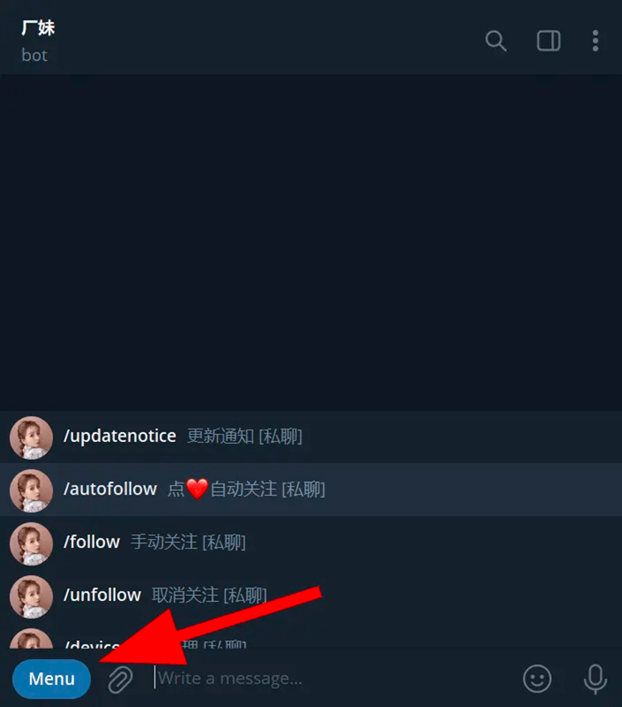

**命令详解**[​](https://web.archive.org/web/20230605010622/https:/embywiki.911997.xyz/docs/base/emby-public-bot/#%E5%91%BD%E4%BB%A4%E8%AF%A6%E8%A7%A3)

**/updatenotice** **更新通知**[​](https://web.archive.org/web/20230605010622/https:/embywiki.911997.xyz/docs/base/emby-public-bot/#updatenotice-%E6%9B%B4%E6%96%B0%E9%80%9A%E7%9F%A5)

更新通知的开关，首次发送即可开启，再次发送则为关闭。

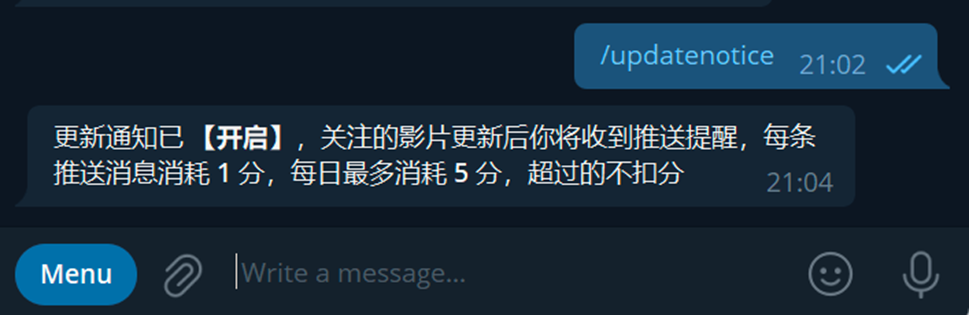

**/autofollow** **点** **♥** **自动关注**[​](https://web.archive.org/web/20230605010622/https:/embywiki.911997.xyz/docs/base/emby-public-bot/#autofollow-%E7%82%B9-%E2%99%A5-%E8%87%AA%E5%8A%A8%E5%85%B3%E6%B3%A8)

由于终点站媒体库过于庞大，该功能可能无法正常工作

在 Emby 内点击喜爱自动关注的开关，首次发送即可开启，再次发送则为关闭。

此功能使用前提必须打开 /updatenotice 更新通知

随后厂妹会发送一个通知，提示该剧集关注成功

若不想再关注，请将该爱心取消；若该剧集已完结，也请将该爱心取消，减小服务器压力。

**/follow** **手动关注**[​](https://web.archive.org/web/20230605010622/https:/embywiki.911997.xyz/docs/base/emby-public-bot/#follow-%E6%89%8B%E5%8A%A8%E5%85%B3%E6%B3%A8)

尚未更新在 Emby 的内容可以通过这个命令进行关注。

此功能使用前提必须打开 /updatenotice 更新通知

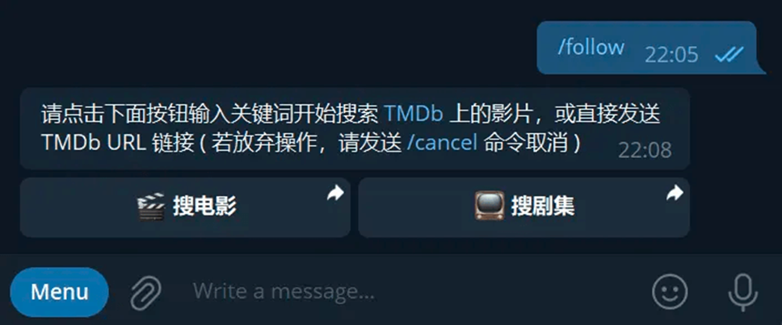

此时直接发送 TMDB 链接或点击搜电影 / 搜剧集搜索你想要关注的内容

关注成功后将会发送关注成功的通知

关注内容有更新时，在 Emby 客户端登录的情况下，可以直接点击按钮直接跳转客户端播放

**/unfollow** **取消关注**[​](https://web.archive.org/web/20230605010622/https:/embywiki.911997.xyz/docs/base/emby-public-bot/#unfollow-%E5%8F%96%E6%B6%88%E5%85%B3%E6%B3%A8)

通过这个命令进行取消关注。

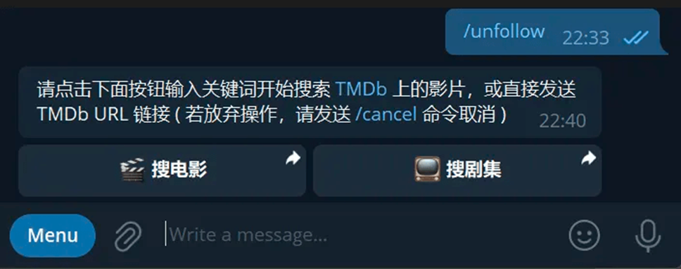

直接发送 TMDB 链接或点击搜电影 / 搜剧集搜索你想要取消关注的内容

**/device** **设备管理**[​](https://web.archive.org/web/20230605010622/https:/embywiki.911997.xyz/docs/base/emby-public-bot/#device-%E8%AE%BE%E5%A4%87%E7%AE%A1%E7%90%86)

列出当前存在登录状态的设备，进行注销登录操作。

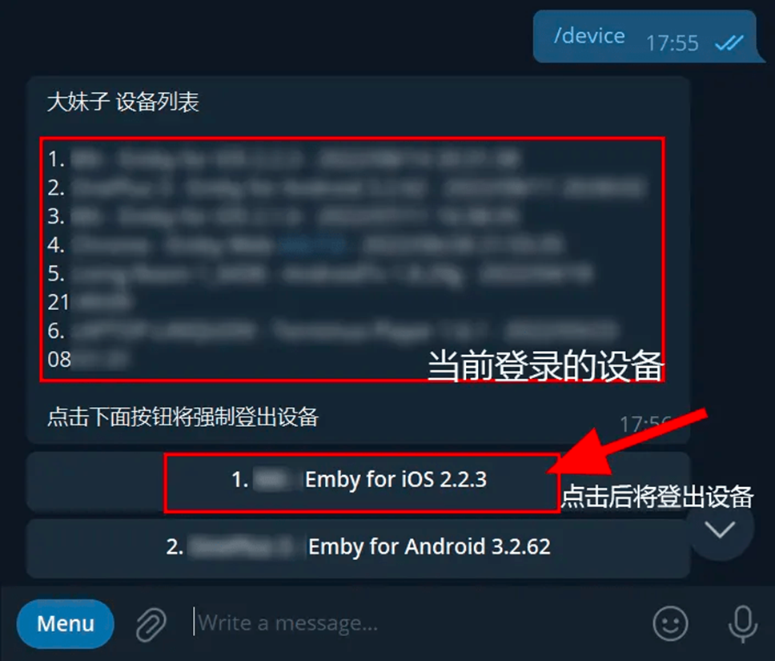

请不要高频率进行操作，否则可能会被判定为 #刷子 导致禁止使用厂妹 7 天。

一般无需刻意进行设备管理。

**/invitecode** **兑换邀请码**[​](https://web.archive.org/web/20230605010622/https:/embywiki.911997.xyz/docs/base/emby-public-bot/#invitecode-%E5%85%91%E6%8D%A2%E9%82%80%E8%AF%B7%E7%A0%81)

请不要以任何形式向他人索取邀请码，该行为将会被 warn 甚至 ban。

使用 1000 积分兑换邀请码，通过邀请码注册无需通过考试也无需等待开放注册。

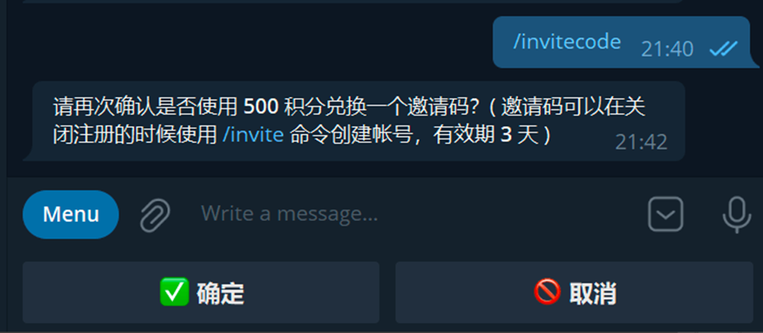

点击确定后，即可兑换邀请码。

**注意：**

*   邀请码仅允许**已有账号**的用户兑换；
*   仅可以将邀请码赠予值得信任的人，倘若注册者发生违规行为被管理封禁，你将会被连坐；
*   邀请码有效期为 3 天，请尽快使用；
*   邀请码无法用于自己的续期；
*   禁止将邀请码用于任何形式的交易行为，一经发现，交易双方都将被永久封禁。

**/invite** **使用邀请码创建账号**[​](https://web.archive.org/web/20230605010622/https:/embywiki.911997.xyz/docs/base/emby-public-bot/#invite-%E4%BD%BF%E7%94%A8%E9%82%80%E8%AF%B7%E7%A0%81%E5%88%9B%E5%BB%BA%E8%B4%A6%E5%8F%B7)

发送 /invite ，根据提示兑换。

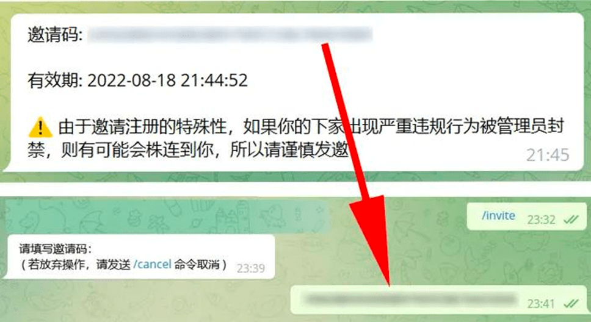

**/invitelist** **邀请列表**[​](https://web.archive.org/web/20230605010622/https:/embywiki.911997.xyz/docs/base/emby-public-bot/#invitelist-%E9%82%80%E8%AF%B7%E5%88%97%E8%A1%A8)

查询所有使用由你生成邀请码的用户。

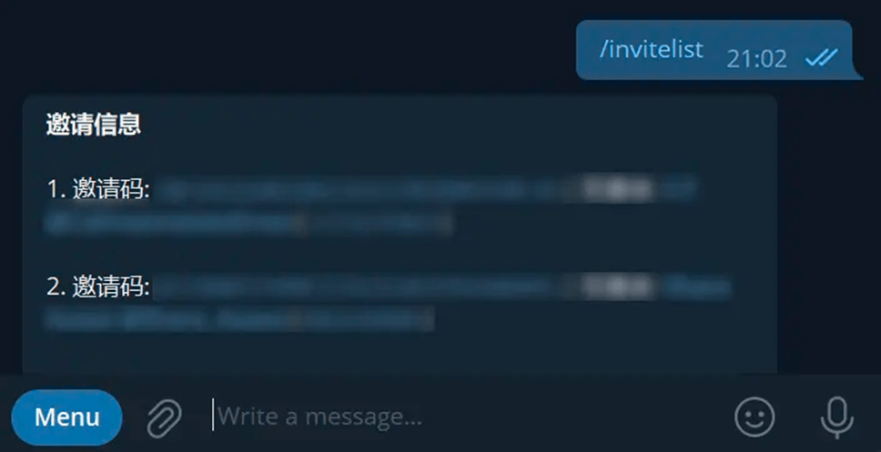

**/renew** **免考试续期**[​](https://web.archive.org/web/20230605010622/https:/embywiki.911997.xyz/docs/base/emby-public-bot/#renew-%E5%85%8D%E8%80%83%E8%AF%95%E7%BB%AD%E6%9C%9F)

可用积分免考试续期一年 ( 目前暂订 500 分 )。

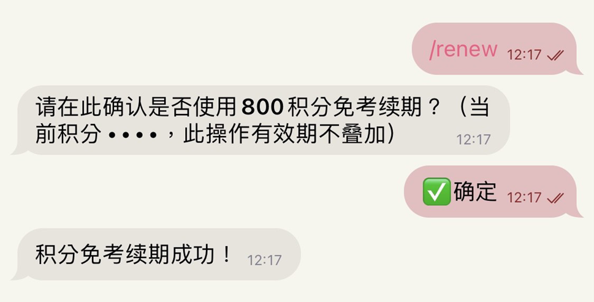

**/rebirth** **恢复被封禁的账号**[​](https://web.archive.org/web/20230605010622/https:/embywiki.911997.xyz/docs/base/emby-public-bot/#rebirth-%E6%81%A2%E5%A4%8D%E8%A2%AB%E5%B0%81%E7%A6%81%E7%9A%84%E8%B4%A6%E5%8F%B7)

可用积分恢复被封禁的账号并续期一年 ( 目前暂订 1000 分 )

**关于** **VIP** **服**[​](https://web.archive.org/web/20230604230349/https:/embywiki.911997.xyz/docs/base/about-vip/#%E5%85%B3%E4%BA%8E-vip-%E6%9C%8D)

除了公益服外，确实存在 VIP 服。VIP 服与公益服一样 —— **永不收费**！

VIP 服 **不等于** 收费服。在群内询问如何购买 VIP 服可能会被踢出群组。

**VIP** **服有什么？**[​](https://web.archive.org/web/20230604230349/https:/embywiki.911997.xyz/docs/base/about-vip/#vip-%E6%9C%8D%E6%9C%89%E4%BB%80%E4%B9%88)

1.  全是 1080p 和 4k 内容；
2.  影片数量是公益服的 N 倍；
3.  多条不同线路的国内高速中转节点实现免梯子直连；
4.  高级 VIP 服还有 [DMM](https://web.archive.org/web/20230604230349/https:/www.dmm.co.jp/top/) 全站月額资源。

**怎么加入** **VIP** **服？**[​](https://web.archive.org/web/20230604230349/https:/embywiki.911997.xyz/docs/base/about-vip/#%E6%80%8E%E4%B9%88%E5%8A%A0%E5%85%A5-vip-%E6%9C%8D)

VIP 服 **不接受主动申请**，它仅供维护公益服的大佬们自己享用。

**是否有可能加入，怎么加入？**[​](https://web.archive.org/web/20230604230349/https:/embywiki.911997.xyz/docs/base/about-vip/#%E6%98%AF%E5%90%A6%E6%9C%89%E5%8F%AF%E8%83%BD%E5%8A%A0%E5%85%A5-%E6%80%8E%E4%B9%88%E5%8A%A0%E5%85%A5)

首先你得有一颗无私的、做公益的心。

**渠道有三**：

1.  成为 [公益服 Telegram](https://web.archive.org/web/20230604230349/https:/t.me/EmbyPublic) 群的义工，为群友长期耐心的提供各种问题的解答；
2.  拥有大量 **少见的优质资源**，能为公益服和 VIP 服的内容输送 **新鲜** 血液；
3.  为 [TMDb](https://web.archive.org/web/20230604230349/https:/www.themoviedb.org/) 网站上的影片 [补充中文信息](https://web.archive.org/web/20230604230349/https:/www.bilibili.com/read/cv3275648)（此举能让全球的媒体管理软件用户受益，包括 Emby 公益服，因为 Emby 公益服也在使用 TMDb 上的影片信息）。

如果满足以上任一条件，就 **有可能** 被大佬 py 进去。

# **题库**

**下面的问题是否是个好提问：我使用 Windows 电脑，在中国联通 200M 宽带环境下，单线程代理测试 158mbp，用 kodi+embyco 进行播放，但是画面加载不断卡顿，请问是什么原因**

是

**在英文交流群组，正确的单词拼写、标点符号和大小写是很重要的。需要花点额外的精力斟酌一下字句。这样的做法**

有必要

**提问的问题如果得不到回答以下哪些做法是错误的？**

重复张贴问题

**Emby 支持以下哪种编解码**

HEVC

**2021年十一假期期间，终点站高可用线路（THA）上线后，用户需要通过测速去选择最优线路么？**

不需要

**在软件使用过程中遇到问题并解决，问题的解决过程应该公开、透明吗？**

应该

**李明直连终点站公益服时，发现速度极慢，于是李明使用代理连接，但发现使用代理后无法连接，下列选项中最有可能导致上述情况的**是

代理

**创建终点站账号前不需要准备以下哪个选项？**

购买NAS

**Emby 不支持下面哪种设备？**

switch

**以下关于强制重考的描述是否正确？**
&ldquo;**在规定时间内未参加重考，原有emby账号会被立刻删除。**&rdquo;

错误

**在终点站使用过程中遇到问题你该怎么做？**

自己找原因解决

**在 Linux 交流群询问 Emby 的使用问题，得不到解决回复，犯了以下哪个错误**

讨论范围不同

**有问题发问，以下行为对的多还是错的多？**
**①把问题发至群内；②私聊群主或管理；③自己查询终点站 wiki；④算了，不会就自己憋着吧；⑤退群**

**错的多**

**以下哪一个算的上一个好问题**

以上都不是

**提问者在提问之时应该针对提问做好哪些心理准备**

以上都是

**在 iPhone 上购买了 Emby 官方客户端的播放权，是否可以在 iPad 上恢复购买？**

可以

**观看 netflix 4k 流畅，看终点站就一定流畅吗。**

不是

**如果你在闲鱼遇到贩卖终点站公益服帐号的商家，你应该怎么做?**

向管理员举报

**动态清零是**

总方针

**如果出现使用emby connect登录你应该:**

a: 点跳过/手动输入

**哪一个国家不能直接访问公益服的备用线路 (也就是cloudflare线路)?**

e: 新加坡|澳大利亚

**使用了 Emby 公益服提供的 Android TV 官方客户端破解版，但一直提示试用即将到期或已过期怎么办？**

e: 破解失败，重新安装

a: 无视它

**美剧里「S1E1」「S2E3」中「E」指英文中哪个单词？**

e: Earthling

**遇到问题想在群里发问，又怕被办怎么办才好呢？**

a: 通读wiki 和提问的艺术全文

**获得VIP的方法？**

a: 长期默默为群组解答问题

**关于开放式提问，以下描述正确的是？**

e: 能获得想要的信息|会让一次聊天变得有意义

a: 以上都是

**从问题属性角度出发，MySQL数据库的使用问题适合在本群组提问吗？**

a: 不适合

**小李想将 Emby 的 APK 安装文件传输到 Mibox 上，这样家里的老人就可以在电视上看 Emby 了，请问以下哪种方式可以将文件传输到电视盒子上？**

a: 以上均可以

**怎么赞助 Emby 公益服？**

a: 他们不接受任何赞助

**如果你想参与一个你不太了解的话题讨论，你应该怎么做。**

a: 不确定的看法要指出，不能误导

**当他人为你排错时，在很基础的常识上，他要求你仔细检查，你应该？**

a: 认真检查并提供你的检查过程

**使用 Emby 的 iOS 客户端观看公益服影片是否需要付费解锁或破解播放权限？**

a: 需要

**提问前 确认自己已确定的各个步骤及其顺序都是必要的？**

a: 正确 失之毫厘差以千里

**群友需要为公益服提供资源吗**

e: 需要

a: 不需要

**http://*.*.*:80 后面的80是指?**

a: 端口号

**关于提问题时做到话不在多而在精的好处，以下描述错误的是？**

e: 更有可能得到有用答案

**emby终点站每隔多久会重置一次密码？**

a: 不会重置

**以下哪一个地区无法使用备用线路直接观看 emby 终点站？**

e: Korea

a: United States

**WIKI中提供的Emby，Android TV客户端，原生Android TV 系统或 Amazon Fire TV应当优先选择哪个版本进行安装？**

a: 破解版 D

e: 破解版 A|破解版 B|破解版 C

**Emby 公益服的账号是什么类型的账号？**

a: 个人独立账号

**如何让神奇女侠失去神力？**

a: 绑住她的双手

**群里大佬有义务和责任耐心回答群友的任何问题么？**

a: 没有，大佬们忙着修水管

**以下关于 Telegram 的说法，不正确的是**

a: 无法在超过10个设备同时登录 

**如果在群里按照规则提问时，被别的聊天刷过去导致一直没有得到回复怎么办？**

a: 耐心等待合适的提问机会

**以下哪种提问方式更好**

a: 详细描述运行环境以及出现的问题

**新人入群必看的东西是？**

a: 以上都是

**挂代理使用Emby时，以下哪种说法正确**

a: 确认走了代理流量

**关于公益服考试中的95%的问题在wiki里有答案对吗？**

e: 正确

a: 错误

**没事别给人制造麻烦。少发语音，多发文字，连续不停的重复问题，对方可能一条都不想看，或者直接无视。**

e: 错误

a: 正确

**本群線路裡的cf是啥？(⊙o⊙)**

a: CloudFlare

**如果你发现wiki中有疑似错误时，你应该怎么做。**

a: 查询相关资料，确认后再反馈

**经研究思考后的问题提出为何往往能够推动问题的解决同时，让提出者和解答者都大有收获**

e: 伴随探讨的交流筛选精华想法

a: 以上都是

**反馈表单求剧时需要填写的内容是？**

a: 以上都是

**以下哪一个算的上一个好问题**

a: 以上都不是

**张飞在Kodi中安装Embycon时遇到缺失依赖项，此时应该**

a: 自行下载安装相关的依赖项

**请选出与其他三项不同的应用**

e: Jellyfin

a: Netflix

**Emby 的官网是哪个？**

a: https://emby.media/

**通过pt站下载的蓝光原盘通常含有哪种关键字**

a: blu-ray

**关于 VIP 服描述错误的是？**

e: 影片数量是公益服的 N 倍

a: 有 DMM 全站资源

**Emby 的 Android 手机客户端在哪下载？**

a: Emby 官网

**加入终点站公益服VIP服描述错误的是？**

a: 向管理员提出申请

**本群線路裡的AGA是哪一家的？(⊙o⊙)**

a: Amazon

**目前 Infuse 终身订阅版售价多少？**

e: $59.99 美元

a: $69.99 美元

**手机客户端上的通过 Emby Connect 登录页面怎么死活登录不了机器人给我的公益服账号密码？**

e: 点击 忘记密码按钮找回

a: 公益服账号不能登录 Emby Connect

**以下哪种提问者的提问 更加符合提问的智慧要求**

a: 带日志、详细说明及照片的材料

**貌似以前有人问的问题自己遇到了怎么办？**

a: 通过tg搜索功能查看聊天记录

**关于修改 Emby 公益服个人账号密码的描述错误的是？**

a: 找群管理员修改

**FHD和D分辨率相比较，影响视频清晰度的主要因素**

e: 分辨率|帧率

**HEVC是什么标准？**

a: 视频压缩标准

**假如有自称是终点站的客服联系你说，交钱可以直接进入vip服，你该怎么办**

a: 举报他，并让他滚

**我国第一部跳过影院，登陆网络流媒体上映的影片是**

e: 《姜子牙》|《中国女排》|《紧急救援》

**请问以下哪种提问不建议使用？**

a: 以上皆不建议

**在emby终点站使用过程中遇到问题你该怎么做？**

a: 尝试自己查找原因解决

**遇到点开播提示没有兼容的流，以下那些是正确的。1. 确认用的不是浏览器2. 尝试更换1/2/3妹和线路3. 私聊厂妹投诉有问题4. 把测试过的各种详细信息发在群里**

a: 1，2，4

**以下哪项不属于考核的目的？**

a: 劝退

**nplayer可以播放终点站吗？**

e: 不可以

a: 可以

**在《提问的智慧》里提到，你做了哪些事情，你很可能被忽略掉或者被看作失败者？（答案详见：https://github.com/ryanhanwu/How-To-Ask-Questions-The-Smart-Way/blob/master/README-zh_CN.md ）**

a: 在与主题不相关的群组提出你的问题

**1080p60中60指的是什么**

a: 帧率

**关于Emby的Windows版本破解，需要替换emby-theater-x64\electronapp\main.js#getAppBaseUrl()方法中的url变量，以下描述正确的是？**

e: 以上都不对

a: 替换官方拉取文件地址

**授人以鱼不如授人以渔，一味的询问就如无休止的黑洞，我们应该在每条路上都养成自主思考的习惯，学会自己解决问题的思路比直接得到问题的答案来的更宝贵些。对于此说法正确吗？**

a: 正确

**Emby 公益服怎么收费的？**

a: 免费

**哪一个国家能直接访问公益服的备用线路 (也就是cloudflare线路)?**

a: 韩国

**我不想花钱去解锁 iOS 的 Emby 官方客户端，能否破解？**

a: 可以

**学会区分问题属性，可以更好的寻求答案，网络代理问题，找到自己使用的代理提供商，Emby相关，找到Emby交流群。这样的做法**

a: 正确

**以下那个问题可能得不到解答？**

a: 以上皆是

**使用 Kodi 连接 Emby 终点站公益服不能使用什么插件？**

a: Emby

**下面哪种方式无法播放 HEVC 视频？**

a: Chrome 浏览器

**入群验证问题回答错误怎么办**

a: 等待两分钟后再次加入

**公益项目，本就任重道远，当我们初体验该项目遇到问题时应采取如下哪个策略**

a: 自主思考，使用搜索

**将 Kodi 系统语言改为简体中文前，需要把皮肤字体设为什么字体？**

a: Arial based

**使用安卓客户端观看时，有的字幕很小，或看着难受，此时应该**

a: 更换大佬的修改版

**如果你的问题解决后，将你的问题和答案转为陈述句张贴在群里帮助更多的人这样做对吗？**

a: 正确

**使用Shadorocket破解IOS版本Emby客户端，Shadowrocket至少需要升级到以下哪个版本号?**

e: v10.0.6

a: v2.1.62

**关于淘宝购买 Infuse 描述错误的是？**

e: 可能会被封设备|可能会被封号

a: 自动发货安全稳定

**关于高级 VIP 服描述正确的是？**

e: 影片数量是公益服的 N 倍

**本群不接受任何质疑其公益属性的声音正确吗？**

e: 错误

a: 正确

**解答别人问题如何做到专业**

a: 对问题进行条理性解答

**如何参与或推动公益服发展**

a: 参与内容搜集与反馈

**请问以下哪种文件格式是音频格式？**

a: DTS

**提问前，把问题再次仔细思考过一遍，草率的发问只能得到草率的回答，一个深究细致的问题，才是解决的开端。对于此说法你认为**

a: 正确

**在emby服务器上如何操作，才能在媒体库中自动生成电影的合集**

a: 安装Auto Box Sets

**你在 Emby 群问了一个问题，无人回应，可能的原因有哪些？**

a: 以上都有可能

**终点站可以用reset命令修改密码（）天修改1次！**

e: 30

**你偶尔真的会碰到无礼和无聊的言行，对真正的冒犯者狠狠地打击，用犀利的语言将其驳得体无完肤都是可以接受的。**

e: 错误

**每个人的时间都很宝贵，对于提问这件事，我们应该**

a: 搜索及深思后无果再阐明提问

**你可以在群里反映什么?**

a: 某部电影/剧集的评价

**加入 Emby 公益服之前需要做什么？**

e: 整理、刮削好影片

a: 以上皆不需要

**大部分视频的帧率范围在？**

e: 60帧-120帧|40帧-60帧

**大多数浏览器不支持哪一个视频解码?**

a: HEVC

**遇到问题提问之前以下做法错误的是？**

a: 私信热心的凯妹管理员

**在提问之前需要做到以下几点？**

a: 以上都是

**你是一名linux使用者，长期有问题向某位技术大佬咨询问题，有一天他开始收费了。**

a: 理解，技术支持不是免费的

**在客户端点播放视频的时候出现:目前没有兼容的流，请稍后重试或联系您的系统管理员了解详情你首先应该:**

a: 更换线路

**提出一个问题需要**

a: 以上都是

**为什么不建议淘宝购买infuse软件**

a: 来源不明 风险巨大

**小李买了 Mibox 方便在电视上使用 Emby，带 Chromecast 功能，请问以下关于 Chromecast 的描述是正确的？**

a: 需要设备在同一局域网使用

**经常遇到别人询问相同的问题时怎么办？**

a: 建议他看wiki和google

**以下多媒体系统开源的是**

a: jellyfin

**emby 的网络连接是什么模式**

e: 多线程

a: 单线程

**以下关于提问的智慧，正确的是**

e: 所有都是|提问直接，少用请、谢谢等无意义词汇

a: 避免用无意义的话结束提问

**你在终点站Emby 电报群提问了一个问题，有人回了一句「看 Wiki」，请问接下来该怎么做？**

a: 感谢回复并认真阅读 Wiki

**有些电视剧的名称有2个甚至3个，当我们搜索其中一个名称，搜索不到影片时应该**

a: 自行查询另外的名称搜索

**加入 VIP 服的渠道是什么？**

a: 被大佬 py

**以下哪种获取 Infuse 的方式不可取**

a: 购买黑卡 App 兑换码

**终点站群内禁止普通群友发一切命令对吗？**

e: 错误

**怎么获取最新的 Emby 公益服线路？**

e: 从 https://t.me/embypub 频道获取

**在苹果设备中使用 emby 官方APP播放DTS 音源的HEVC视频，且 emby 服务器端没有打开特定权限的转码服务，会出现什么情况？**

a: 只有画面无声

**Emby 公益服使用过程中遇到问题该怎么办？**

a: 先查看 Wiki 文档，实在找不到答案再去群里求助并详细说明

**Emby 公益服上的影片中文信息来自哪里？**

a: TMDb

**在群里问题被解决了第一时间做什么？**

a: 诚心的发表一个感谢声明

**求资源的正确方式**

a: 反馈表里填写，附上tmdb链接

**Emby 详情页面可以看到该剧的分级，以下哪个等级仅供 18 岁以上人观看**

e: TV-PG|TV-G

**使用 Kodi 连接 Emby 公益服可以使用 Emby 插件吗？**

a: 不可以

**关于在提问题时，让专家花在辨识问题和回答所需要付出的时间减到最少，以下做法正确的是？**

a: 提炼精简，明确表达问题

**你在终点站电报群请教大大的问题解决了，可以做以下哪种行为？**

a: 有群友遇到类似问题主动帮助

**在英文交流群组，正确的单词拼写、标点符号和大小写是很重要的。**需要花点额外的精力斟酌一下字句。这样的做法

a: 有必要

**不能在浏览器上播放什么编码的影片？**

a: HEVC

**提问的问题如果得不到回答以下哪些做法是错误的？**

a: 重复的张贴问题

**在群组里做了什么会Ban？**

a: 发点对大家有益的小广告

**Emby 公益服的电报频道地址是什么？**

a: https://t.me/embypub

**Emby 公益服的 Wiki 地址是什么？**

a: [https://embywiki.911997.xyz](https://embywiki.911997.xyz/)

**以下哪些内容是提问者向解答者说明时不需要阐述的**

a: 公益服账户信息

**当使用emby客户端连接公益服观看影片时提示 当前没有兼容的流，请联系管理员 ，你应该怎么办？**

a: 检查本地网络连接及客户端

**挂了梯子之后公益服仍然卡顿应该怎么办?**

a: 更换别的线路/富强节点

**成功进入 Emby 终点站电报群后，第一件要做的事情是什么?**

a: 点看置顶并详细阅读wiki

**emby是啥？(⊙o⊙)**

e: 電影資料庫

a: 哪個都不是

**我运行了Emby的客户端，它弹出一个警告窗口，我试着关掉它，它就崩溃了。以上提问有什么问题？**

a: 使用了表述不清的代词

**Emby 公益服电报群地址是什么？**

e: https://t.me/embypub

a: https://t.me/EmbyPublic

**怎样的态度有助于问题的解决？**

a: 把自己的事做好然后恭敬的请问

**不考虑损耗情况下，一度电可供一只50瓦的灯泡照明几小时?**

a: 20

**Emby 公益服的每台服务器都是相互独立的，在某台服务器上的播放记录与收藏的影片并不会同步到其他服务器上去。**

e: 错误

a: 正确

**公益服在哪里密码重置**

a: 私聊厂妹发送/reset

**如何得知大妹、二妹和三妹的状态?**

a: 发/status给厂妹

**如何免费获取 Infuse？**

a: 申请成为 Infuse 的测试员

**对于更好的回答问题以下哪个做法是错误的？**

a: 态度恶劣，不友善

**忘记密码了怎么办?**

a: 找厂妹重置密码

**使用苹果的emby官方app中，选择哪一个音源会出现只有画面输出却没有声音或提示没有兼容的流?**

e: TRUEHD|EAC3

**国内网络环境错综复杂，群友使用香港AGA线路流畅观影，而自己不能使用时应采取如下哪个策略**

a: 自行更换其它线路测试

**如果外语电影或剧集没有中文字幕，不应该怎么做?**

a: 私聊管理员要

**以下哪项是本群的设立目的之一？**

a: 交流、推荐和讨论影视剧集内容

**使用 Shadowrocket 破解Emby时遇到GitHub污染该怎么办**

a: 使用备用脚本

**Emby内购的钱 去哪里了？**

a: Emby LLC (Emby开发者)

**对于使用浏览器无法播放，以下说法正确的是？**

a: 没有仔细阅读使用手册

**牛津大学高才生、电机工程硕士、抑郁症、给非洲捐款最多的明星这些标签的集合指的是哪个角色的扮演者？**

e: 杰森伯恩

a: 憨豆

**以下哪种问题可以提交反馈**

a: 可以在特定设置下复现的

**观看netflix 4k流畅，看公益服就一定流畅吗。**

a: 不是

**提出问题前前尽量揣测回答者的反问并做好准备是有必要的吗？**

a: 是

**Telegram 账号最长每隔多久不登录会被删除账号？**

a: 一年

**能否在公开场合展示 Emby 公益服的线路信息？**

a: 不能，发现就 ban

**在lnfuse软件中添加厂妹公益资源应该选择那个添加**

a: 选择其他emby

**如何查看 Emby 公益服的服务器状态？**

a: 找机器人发送 /status 命令查看

**怎么加入 VIP 服？**

a: 有重大贡献可免费获邀

**emby公益服的线路是固定的吗？**

a: 不是，视使用情况增减

**公益服暂停注册期间，小李想体验下，应当怎么做。**

a: 学习emby相关知识耐心等待

**Infuse 的搜索功能为什么搜不到 Emby 公益服的影片？**

a: 没有同步完成

**如果播放出现有声音没画面或有画面没声音大概是什么问题?**

e: 线路卡了

a: 设备解码问题

**终点站的帐号是否支持上传自定义头像？**

a: 是

**使用苹果的emby官方app在播放某些片源的时候，为什么会出现只有画面输出，却没有声音的情况?**

e: 官方app不支持Dolby音源

**辨析以下行为是否正确小刘在向管理员反应使用公益服出现问题的时候，情绪特别激动，并不断的私聊管理员，渴望得到解答**

a: 错误

**常常美剧里发现有「S1E1」「S2E3」类似的标记，请问其中的「S」指英文中哪个单词？**

e: Series

a: Season

**在Linux交流群询问Emby的使用问题，得不到解决回复，犯了以下哪个错误**

a: 讨论范围不同

**为了应对新入的用户，水管工马里奥增加了新的服务器，曹妮玛同学想试一下新的服务器，同时因为家中登录了其他设备，并不想重新设置登录。此时他应该**

a: 用大妹的登录信息登陆新妹

**提问者提出问题，在面对解答者的解答时，应该学会从相关资料中获取信息，而不是不经思考式地接受，因为这是无效率的。**

a: 正确

**急于解决某问题时正确的做法是**

a: 群里询问后一边等待一边自己解决

**iPhone/iPad/mac 客户端上 30 元解锁正版 Emby 客户端的钱由 Emby 终点站和苹果收取。**

e: 正确

a: 错误

**哪一个客户端不能完整体验emby公益服?**

a: google浏览器

**iOS端使用观看公益服的正确方式**

a: emby客户端30元内购

**Android 手机用户可以直接使用 Emby 官方客户端播放公益服视频，无需付费或者去用破解版。**

e: 错误

a: 正确

**怎么联系 Emby 公益服的客服人员？**

a: 不能联系，因为没有客服

**使用翻墙软件破解了 Emby 的 iOS 客户端，以后是否每次播放视频都要重新破解？**

a: 不需要

**公益服对资源贩卖的态度是什么**

a: 坚决打击

**Infuse从哪个版本开始支持Emby协议？**

e: Infuse 5

a: Infuse 6

**以下那套是王家衛的電影**

a: 花樣年華

**被Ban之后还有机会回来吗？**

a: 原则上没有机会

**和善的解答态度是帮助他人完成问题解决的一个重要因素之一**

a: 正确

**Emby 公益服的个人账号是否可以共享给他人使用？**

a: 不可以，只能自己和家人使用

**在软件使用过程中遇到问题并解决，问题的解决过程应该公开、透明吗？**

a: 应该

**以下哪些个是蠢问题？1.我能在哪里找到Emby安装包？2.我的客户端运行中出现了问题，有人能帮我吗？3.客户端可以在xxx设备上运行吗？**

a: 123

**在使用软件时遇到问题，请求帮助时，需要按发生时间先后列出问题的症状吗？**

a: 需要

**macOS 上使用 Infuse 的 alpha 测试版观看 Emby 公益服是否需要付费购买？**

a: 不需要

**在群聊中提问长期没有人回答，且被管理员警告往往是因为？1.这个问题过于复杂，以群聊成员的水平无法回答2.这个问题的提出者不具备专业能力3.这个问题已经在wiki中出现过，并给出了解决方案4.这个问题具有挑战性**

a: 3

**VIP 服怎么收费？**

a: 免费

**Emby 手机客户端看片时字幕字体不习惯怎么办？**

a: 使用公益服 Wiki 上提供的修改版客户端

**infuse添加Emby服务器，同步视频资源时，老是中断怎么办**

a: 保持软件活跃或越狱装真后台插件

**使用 emby 公益服很卡，以下哪一个办法可以彻底解决问题？**

e: 更换线路|使用代理

a: 花钱支持正版流媒体

**Hakuna Matata出自那一部电影**

e: 怪物公司

**YouTube上万速度 公益服连接一定流畅吗？**

a: 不是

**哪一个系统的用户可以免费使用完整的emby客户端服务?**

a: android

**辨析以下行为是否正确大学生小刘把账号分享给女友使用，女友随后告诉了闺蜜和室友，闺蜜和室友进行进一步传播，并使得一个班都在使用同一个账号**

a: 错误

**Emby 公益服播放卡顿怎么办？**

a: 换服务器、换线路、挂梯子

**如果emby官方客户端出现付费解锁的提示，最快解锁的方法是?**

e: 支付54刀/340元

**Kodi 可以在哪些平台上安装？**

a: 几乎所有主流平台上都能安装

**如何获取最新的线路信息**

e: 私聊厂妹发送/status|私聊厂妹发送/xianlu

**如果你人为地将问题搞得难以阅读，它多半会被忽略将不会得到回答对吗？**

a: 正确

**当找到的解决办法都是外语看不懂时怎么办？**

a: 使用一键翻译

**如何更好的回答问题**

a: 态度和善 引导解决

**Infuse 可以在哪购买？**

a: App Store

**小张在浏览谷歌的时候，发现有博主利用公益服进行引流 同时公布了账号 密码和线路 他该怎么办**

a: 联系公益服管理员

**你在群里发什么不会被管理员立刻ban？**

a: 发emby客户端的牢骚

**在群里问wiki里有解决方法的问题会怎么样？**

a: 被要求出门右拐爱优腾

**下面哪些设备不支持Emby？**

a: Windows Phone

**获得新的账号后如何修改三个服务器的登录密码**

e: 登录任意一个服务器修改即可

**在厂妹那考核时，遇到傻逼问题应该怎么办？**

a: 求证后确定此题有误，向群主举报

**所有问题一律不能带情绪提问对吗？**

a: 正确

**在最新版的机器人中，新注册的账号可以自行设置密码，不再是随机密码。**

e: 正确

a: 错误

**群里谈论什么话题可能会遭到封禁**

a: emby plex 付费服务器

**请问一下，我的电脑上不能播放emby怎么解决？谢谢对于此提问，以下说法正确的是**

a: 问题无意义描述不清晰

**为什么在公共群组中提问，会比私聊大佬提同样的问题更容易得到有用的回答？**

e: 潜在的回复者多

**终点站的影片，中文外挂字幕名称是什么？**

a: Und

**有想看的电影和剧集，服务器上却没有，应该怎么办？**

a: 在反馈表单反映

**良好而恰当的标题往往能吸引问题解决者的到来，过于危言耸听或者没有逻辑的标题反而会加剧对提问者的反感。**

a: 正确

**在macOS 上安装EMBY Electron客户端，需要先执行一条命令 brew install mpv，这个命令的作用是？**

a: 安装mpv播放器

**公益服一般是什么时候开放注册呢?**

a: 随缘.去按摩都不能每次赶上头牌

**提出一个问题时，提倡用最简单的语言表达出最多的信息有什么好处？**

e: 可能精简中找到解决办法和思路|使你更有可能得到有用的答案

**以下属于无效的问题是？**

a: 都是

**以下哪些方式可能增加连接emby公益服的速度**

a: 以上都是

**我现在有了公益服的帐号，我可以分享给谁?**

a: 你身边的朋友、家人

**FHD和HD的主要区别是？**

e: 帧率

**Emby是否支持DLNA？**

a: 支持

**如果群内提问者的问题长久，或者多次得不到回答，那么这时，提问者需要考虑**

a: 是否问题足够简单，不需要回答

**本公益服的 公益 之含义？a）不光要免费分享资源给你，我还要当你的保姆，耐心回答你的所有问题，而且在你考试不通过或者注册账户不成功的时候听你的抱怨。b）公益就应该零门槛，就好像医生义诊的时候，医生不单要免费看病，而且所有的药费都要医生掏腰包，而且医生还得保证把病治好，否则就是假公益。c）我可以免费让你分享我的劳动成果但是你至少不要觉得一切都是理所当然的。 d）以上都正确**

a: C)

**淘宝购买的 Infuse 能否使用 Emby 公益服？**

e: 可以

a: 不能

**在何种情况下提问很可能被忽略掉？**

a: 以上都是

**群里忌讳哪些人？**

a: 全部选项

**注册 Emby 公益服账号应该找谁？**

a: https://t.me/EmbyPublicBot

**使用途中遇到問題該怎麼做?**

a: 先看wiki找找答案

**在 iPhone 上购买了 Emby 官方客户端的播放权，能否在 iPad 上恢复购买？**

a: 可以

**如果大妹子不理你，你应该怎么办？**

a: 跟二妹，三妹玩

**reset是机器人的什么命令？**

a: 密码重置

**Amazon Fire TV是基于哪个系统修改而成的？**

a: 安卓

**在你准备要通过telegram提出技术问题前，需要做什么？**

a: 查看wiki和置顶以找到答案

**在使用Emby终点站的群组聊天中，经常抬头可以帮助**

a: 看到置顶消息和群名

**在《提问的智慧》里，如果你看不懂回应，你不应该做什么？（**答案详见：https://github.com/ryanhanwu/How-To-Ask-Questions-The-Smart-Way/blob/master/README-zh_CN.md）**

e: 尝试阅读手册以找到答案|尝试上网搜索答案|尝试FAQ以找到答案

a: 立刻要求对方解释

**哪一个是正式且低成本获取infuse的途径?**

a: 申请成为infuse测试员

**在 iOS 上购买了 Emby 官方客户端的播放权，能否在 macOS 上恢复购买？**

a: 不能

**当你遇到问题在各种尝试后，还是不能解决。**准备去群里发出提问，你需要如何描述你的问题？

a: 说明系统客户端几号厂妹线路电影

**终点站是否可以通过捐赠获得本服务器VIP？**

a: 不可以

**Emby公益服要求考核是为了：**

a: 所有选项皆是

**如何对群内解答者的回答内容进行解析**

a: 终点站wiki的内容结合

**有些提问即使你很急也不要在标题写紧急，这是为什么？**

a: 以上都是

**三个服务器的播放记录同步吗**

a: 不同步

**下面关于公益服的提问是否合理我的电信宽带500M 油管跑分10w为什么看不了公益服 是不是服务器挂了**

a: 不合理

**关于 Emby 公益服几台服务器描述正确的是？**

e: 修改一台服务器的密码后，其它服务器密码也会同时修改

a: 服务器之间数据是相互独立的

**Emby 的 iOS 客户端付费解锁播放权限时应该购买哪一个（中国区 App Store）？**

e: 45 元的

a: 30 元的

**如果发现有人售卖公益服账号应该怎办？**

a: 和群里的管理们举报

**在群里提问得到RTFM或STFW的回答时怎么办？**

a: 问题过于简单阅读手册或谷歌

**电视剧集中，为了规避风险，TXB最有可能代表的是以下哪个公司或平台？**

e: 爱奇艺独播剧场

a: TVB

**Kodi应该装什么插件？**

e: Emby Plugin

**破解Emby Theater windows的过程中，main.js里的tv.emby.media应该更改为:**

a: tv.emby.neko.re

**当你在公益服使用中发现问题无法解决，但是又不敢在群里表达自己的疑问的时候，你应该怎么做**

a: 翻看聊天记录并Google

**什么人才能创建 Emby 公益服账号？**

a: Telegram 用户

**infuse添加https线路正常，但添加http线路时提示用户名或密码错误应该怎么办**

a: 尝试升级infuse的版本解决

**佩服大佬的公益做法想出一分力要怎么做！**

a: 以上三项

**电脑浏览器播放卡顿提示或画音不同如何解决**

a: 使用emby相关客户端播放

**在emby客户端使用方面如果出现问题，除了群组内部提问，你还有什么方式可以学习？**

a: 以上都是

**神奇女侠的创作者是谁？**

e: 斯坦·李老爷子

**当群友讨论一个未解决的问题，而你解决了这个问题，这种情况下我们应该**

a: 分享自己的解决经验供参考

**为什么晚上中国大陆观看公益服速度可能会偏慢**

e: 公益服服务器爆炸

a: 出国流量拥挤

**HEVC的另一种称呼**

e: H.266

**公益服的客服是谁**

a: 没有客服

**入群回答问题错误被机器人踢出后，几分钟后可以再次申请入群？**

a: 2分钟

**提问者在解答者回应之前，将其可能提出的各个问题进行预演，回应，可能使问题的解决更加有效率**

a: 正确

**如果使用公益服期间遇到卡顿，你应该做什么?**

a: 尝试富强/更换线路

**判断以下是否是一个良好提问我使用Windows电脑，在中国联通200M宽带环境下，单线程代理测试158mbps用kodi+embycon进行播放 但是画面加载不断卡顿，请问是什么原因**

a: 是

**发现播放卡顿想提出问题前要做到什么？**

a: 以上都对

**emby支持以下哪种编解码**

a: HEVC

**关于Emy公益服制作的破解版IOS客户端的安装方式有哪些？**

a: 以上都可以

**如何反馈字幕缺失或海报内容不符等问题**

a: 填写表单反馈

**使用 Kodi 观看 Emby 公益服是否需要付费？**

a: 不需要

**支持4k60hz的接口是**

a: hdmi2.0

**李明直连厂妹时，发现速度极慢，于是李明使用代理连接厂妹，但发现使用代理后无法连接厂妹，下列选项中最有可能导致上述情况的是**

a: 代理

**问题提出者所拥有的哪种特质，能够更让解答者有意愿进行问题的回答**

e: 所有选项都是

**本群不会有人蓄意讽刺和攻击你除非你的问题白痴到惹人厌烦**

a: 正确

**英语俗语and chill中 and之前正确的单词是什么？**

a: NetFlix

**水管工新添了新的线路，你应该找谁要新的线路?**

a: 跟厂妹获取线路

**当你遇到个人无法解决的问题向群组求助，他人要求你描述发生经过，你应该？A、在群组中根据自己的记忆进行文字表述B、在群组中使用录屏的方式将问题复现C、PM他人，根据自己的记忆进行文字表述D、PM他人，并使用录屏的方式将问题复现**

a: B

**tg求资源表格每天限求（）每周限求（）？**

e: 1，5

**如果别人的提问不小心冒犯了你，你该如何回应？**

a: 平静的反应

**以下哪种提问方式更容易获得别人的帮助**

a: 详细说明线路、节点、客户端等

**当发现使用公益服存在的问题时，应该对情况进行详细描述，而不只是进行自行推测**

a: 正确

**以下哪个选项代表全局模式**

a: Global

**乔布斯收购皮克斯之后制作了第一步由电脑制作的动画长片，这部电影的名字是什么？**

a: 玩具总动员

**以下哪个命令是查看服务器状态？**

a: status

**当在群里发现有群友使用自己没有的线路，该怎么办**

e: 在群里询问新线路的地址

**下列提问者的哪些因素会影响对他问题的解答**

e: 所有选项都是

**如果要在路由器中设置强制代理某域名使用科学上网，应该添加的域名部分是？例如：https://*.*.*:443**

a: *.*.*

**在苹果生态里，除了infuse可以解决DTS音源播放问题，以下哪些软件也支持DTS音源的播放**

a: nPlayer