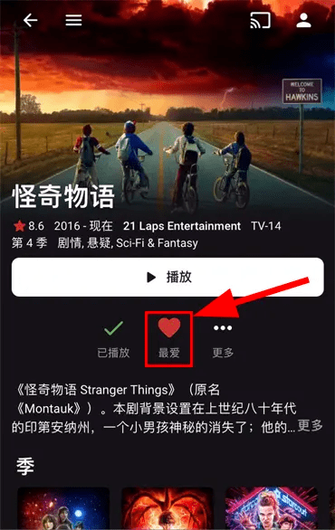

## **Emby** **是什么？**[​](https://web.archive.org/web/20230605003808/https:/embywiki.911997.xyz/docs/base/introduction/#emby-%E6%98%AF%E4%BB%80%E4%B9%88)

[Emby](https://web.archive.org/web/20230605003808/https:/emby.media/) 是一个家庭媒体库软件，包含服务端和客户端。服务端用于整理电影和剧集，客户端连上服务端后就能播放这些影片。

## **关于本** **Emby** **公益服**[​](https://web.archive.org/web/20230605003808/https:/embywiki.911997.xyz/docs/base/introduction/#%E5%85%B3%E4%BA%8E%E6%9C%AC-emby-%E5%85%AC%E7%9B%8A%E6%9C%8D)

本 Emby 公益服是一个免费影视媒体库，让你免去自己购买 NAS 或服务器来下载、整理、刮削影片等诸多麻烦的流程，只需要用 Emby 客户端连上 Emby 公益服务器即可在各种设备上观影。

## **承诺**[​](https://web.archive.org/web/20230605003808/https:/embywiki.911997.xyz/docs/base/introduction/#%E6%89%BF%E8%AF%BA)

**公益服永不收费！公益服永不收费！公益服永不收费！**

## **入群须知**[​](https://web.archive.org/web/20230605003808/https:/embywiki.911997.xyz/docs/base/introduction/#%E5%85%A5%E7%BE%A4%E9%A1%BB%E7%9F%A5)

*   群内严禁出现任何形式的广告，包括但不限于 ID、暗示、频道、AFF 链接等；
*   群内禁止讨论 Emby 收费服以及 机场；
*   为了公益服长久发展，请勿在任何场合展示、露出本站的 Emby 链接，账号亦仅限个人使用；
*   在群内发问前请先确认自己的问题在本 Wiki 中无法找到答案，否则你可能会被踢出去；
*   公益服没有客服，不提供技术支持，也不接受任何赞助。

# **关于考核**[​](https://web.archive.org/web/20230605003155/https:/embywiki.911997.xyz/docs/base/about-exam/#%E5%85%B3%E4%BA%8E%E8%80%83%E6%A0%B8)

**通过考核是获取账号的前提条件。**

## **考核的目的**[​](https://web.archive.org/web/20230605003155/https:/embywiki.911997.xyz/docs/base/about-exam/#%E8%80%83%E6%A0%B8%E7%9A%84%E7%9B%AE%E7%9A%84)

本 Emby 公益服要求考核是为了：

1.  让用户了解 Emby 和 Emby 公益服的基本使用方法；
2.  让群里的技术交流变得更为高效和有意义，而非机械性地重复回答基础问题；
3.  确保用户在遇到问题时有寻求解决方法的基本能力；
4.  阻止机器人抢注和贩卖账号的牟利者，尽量让有需求的人获得使用资格。

**_如果你看到这里已经觉得很麻烦，欢迎左转不需要考核的其它公益服，或者订阅爱腾优奈的会员。_**[​](https://web.archive.org/web/20230605003155/https:/embywiki.911997.xyz/docs/base/about-exam/#%E5%A6%82%E6%9E%9C%E4%BD%A0%E7%9C%8B%E5%88%B0%E8%BF%99%E9%87%8C%E5%B7%B2%E7%BB%8F%E8%A7%89%E5%BE%97%E5%BE%88%E9%BA%BB%E7%83%A6-%E6%AC%A2%E8%BF%8E%E5%B7%A6%E8%BD%AC%E4%B8%8D%E9%9C%80%E8%A6%81%E8%80%83%E6%A0%B8%E7%9A%84%E5%85%B6%E5%AE%83%E5%85%AC%E7%9B%8A%E6%9C%8D-%E6%88%96%E8%80%85%E8%AE%A2%E9%98%85%E7%88%B1%E8%85%BE%E4%BC%98%E5%A5%88%E7%9A%84%E4%BC%9A%E5%91%98%E3%80%82)

## **考核前的须知**[​](https://web.archive.org/web/20230605003155/https:/embywiki.911997.xyz/docs/base/about-exam/#%E8%80%83%E6%A0%B8%E5%89%8D%E7%9A%84%E9%A1%BB%E7%9F%A5)

*   **每次**考试需要有足够的 _每日签到_ 积分，_积分_ 和每次考试所需的 _积分要求_ 都可以通过 **厂妹** **Bot** [@EmbyPublicBot](https://web.archive.org/web/20230605003155/https:/t.me/EmbyPublicBot) 进行获取。
*   积分**仅**可以通过 _每日签到_ 获取，每日随机获得 1-5 分。
*   考试开始前请自行测试厂妹 Bot 有否出现响应缓慢等状况，否则有可能会影响你无法按时完成考试。
*   考试正式开始后（即点击 **开始** 按钮后），即扣除所需积分并不会返还。开始考试前请确认准备充足且不会有其他因素影响考试。
*   如果发送 /exam 命令无法开始考试，请尝试发送 /cancel 后再次发送 /exam 。依旧无反应则说明题库正在维护，请关注并等待群公告通知。
*   如果题目有问题，请截图私信 [管理员](https://web.archive.org/web/20230605003155/https:/t.me/marioplumber) 告知。
*   严禁在群内或其它公开场合讨论题目或索要答案。这会被视为泄题行为，管理员可以直接 ban，并删除相关消息。

## **考核的范围**[​](https://web.archive.org/web/20230605003155/https:/embywiki.911997.xyz/docs/base/about-exam/#%E8%80%83%E6%A0%B8%E7%9A%84%E8%8C%83%E5%9B%B4)

考核内容包括

*   [白嫖手册 Wiki](https://web.archive.org/web/20230605003155/https:/embywiki.911997.xyz/)
*   [提问的智慧](https://web.archive.org/web/20230605003155/https:/github.com/ryanhanwu/How-To-Ask-Questions-The-Smart-Way/blob/main/README-zh_CN.md)
*   群置顶资讯和通过简单搜索 (例如 [Google](https://web.archive.org/web/20230605003155/https:/www.google.com/)) 可获得答案的题目。

题目从题库里 **随机** 选择，所以每次考核的题目基本不一样。

_注：没有复习用的题库。考核是手段，不是目的。_

## **考核的形式**[​](https://web.archive.org/web/20230605003155/https:/embywiki.911997.xyz/docs/base/about-exam/#%E8%80%83%E6%A0%B8%E7%9A%84%E5%BD%A2%E5%BC%8F)

*   考核内容为 40 题单选题，每题 2.5 分，最终得分 90 分（即正确 36 题）或以上者通过考核。
*   考核需要在 20 分钟内完成。
*   未通过考核者可以在 72 小时后再次尝试考核。

_注_ _1__：由于机器人不显示小数点，所以会出现__93__分这种分数，实际分数其实是__92.5__分。_

_注_ _2__：考核结束时若显示花费__20__分钟，即花费了__20__分钟以上__21__分钟以下的时间，实质上仍为超时。_

## **如何考核**[​](https://web.archive.org/web/20230605003155/https:/embywiki.911997.xyz/docs/base/about-exam/#%E5%A6%82%E4%BD%95%E8%80%83%E6%A0%B8)

*   请向 **厂妹** [@EmbyPublicBot](https://web.archive.org/web/20230605003155/https:/t.me/EmbyPublicBot) 私聊，发送 /exam 命令。

_注：如果发送命令后没反应，请先发送_ _/cancel_ _后再尝试。这是_ _Telegram_ _机器人的_ _bug__。_

*   根据提示，点击**开始**，即可开始考试。

_注：如果没有看到**开始**按钮，请先发送_ _/cancel_ _后再尝试更换客户端考试。_

*   若考核通过会显示获得注册资格，在服务器开放注册期间即可 ** [创建账号](https://web.archive.org/web/20230605003155/https:/embywiki.911997.xyz/docs/base/create-account/index) **。

## **考核的界面**[​](https://web.archive.org/web/20230605003155/https:/embywiki.911997.xyz/docs/base/about-exam/#%E8%80%83%E6%A0%B8%E7%9A%84%E7%95%8C%E9%9D%A2)

## **来自满分大佬们的心得：**[​](https://web.archive.org/web/20230605003155/https:/embywiki.911997.xyz/docs/base/about-exam/#%E6%9D%A5%E8%87%AA%E6%BB%A1%E5%88%86%E5%A4%A7%E4%BD%AC%E4%BB%AC%E7%9A%84%E5%BF%83%E5%BE%97)

*   考试前请先仔细阅读[白嫖手册 wiki](https://web.archive.org/web/20230605003155/https:/embywiki.911997.xyz/)
*   题目不会根据你的需求和使用环境调整，所以即使你认为某部分你用不到，也先了解大概内容，并在遇到相关题目的时候知道如何查找。
*   请先阅读一次[提问的智慧](https://web.archive.org/web/20230605003155/https:/github.com/ryanhanwu/How-To-Ask-Questions-The-Smart-Way/blob/main/README-zh_CN.md)，理解里面的原则。 这对你以后在群里的讨论和互动也有帮助。
*   考核是开卷的形式，部分问题需要上网搜索获取答案（除非你有广泛的知识背景）。
*   请仔细阅读题目，确保你没有理解错误。
*   考核时间为 20 分钟，只要了解考核内容，时间相当充分。如果遇到不确定的问题请花时间思考和上网查证。请自行准备计时工具以防超时。
*   即使你这次已经因为过多错误无法通过考核，继续答题仍然对你下次考核有所帮助。

## **来自被放逐者的教训**[​](https://web.archive.org/web/20230605003155/https:/embywiki.911997.xyz/docs/base/about-exam/#%E6%9D%A5%E8%87%AA%E8%A2%AB%E6%94%BE%E9%80%90%E8%80%85%E7%9A%84%E6%95%99%E8%AE%AD)

以下行为或发言可能会导致你被警告或直接封禁账号：

*   在任何地方（包括公益服讨论群）公开泄露或讨论考题。

A：题库采纳的考题已经过水管工审查。如果对考题有异议，请私聊水管工。

*    为什么要考试？这是耍猴吗？

A：考核的目的请参考本页相关条目。

*    考试太难了。分数要求太高。

A：目前群里已经有超过 1 万人成功注册，所以通过考核并非无法企及的目标。_(__话说你当年读书的时候会跟老师要求降低及格线吗？__)_

*    我根本不会用 XX，为什么要问我这种问题？

A：题目不会根据你的需求和使用环境调整。其他用户可能也不使用你在使用的设备。

*    这种问题根本和 Emby/ 考核范围没关系。

A：此类问题的目的在于考核你的搜索能力。这符合 [提问的智慧](https://web.archive.org/web/20230605003155/https:/github.com/ryanhanwu/How-To-Ask-Questions-The-Smart-Way/blob/main/README-zh_CN.md) 里面的原则。

*    怎么注册？怎么考试？不会。

A：………………

**_如果你看到这里还是觉得很麻烦，请不要犹豫，本服务器可能并不适合不喜欢折腾的你。_**[​](https://web.archive.org/web/20230605003155/https:/embywiki.911997.xyz/docs/base/about-exam/#%E5%A6%82%E6%9E%9C%E4%BD%A0%E7%9C%8B%E5%88%B0%E8%BF%99%E9%87%8C%E8%BF%98%E6%98%AF%E8%A7%89%E5%BE%97%E5%BE%88%E9%BA%BB%E7%83%A6-%E8%AF%B7%E4%B8%8D%E8%A6%81%E7%8A%B9%E8%B1%AB-%E6%9C%AC%E6%9C%8D%E5%8A%A1%E5%99%A8%E5%8F%AF%E8%83%BD%E5%B9%B6%E4%B8%8D%E9%80%82%E5%90%88%E4%B8%8D%E5%96%9C%E6%AC%A2%E6%8A%98%E8%85%BE%E7%9A%84%E4%BD%A0%E3%80%82)

**_欢迎左转去往不需要考核的其它公益服，或者订阅爱腾优奈的会员。_**[​](https://web.archive.org/web/20230605003155/https:/embywiki.911997.xyz/docs/base/about-exam/#%E6%AC%A2%E8%BF%8E%E5%B7%A6%E8%BD%AC%E5%8E%BB%E5%BE%80%E4%B8%8D%E9%9C%80%E8%A6%81%E8%80%83%E6%A0%B8%E7%9A%84%E5%85%B6%E5%AE%83%E5%85%AC%E7%9B%8A%E6%9C%8D-%E6%88%96%E8%80%85%E8%AE%A2%E9%98%85%E7%88%B1%E8%85%BE%E4%BC%98%E5%A5%88%E7%9A%84%E4%BC%9A%E5%91%98%E3%80%82)

**考核通过后的注意事项**[​](https://web.archive.org/web/20230605003155/https:/embywiki.911997.xyz/docs/base/about-exam/#%E8%80%83%E6%A0%B8%E9%80%9A%E8%BF%87%E5%90%8E%E7%9A%84%E6%B3%A8%E6%84%8F%E4%BA%8B%E9%A1%B9)

假设你考试通过了，那么还需要注意...

*   考试通过 **不等于** 可以立即 [创建账号](https://web.archive.org/web/20230605003155/https:/embywiki.911997.xyz/docs/base/create-account/index)，需等待水管工开启注册（开启时间随缘，大家需时常关注终点站的 [群组](https://web.archive.org/web/20230605003155/https:/t.me/EmbyPublic) 和 [频道](https://web.archive.org/web/20230605003155/https:/t.me/embypub)）。
*   账号有效期从考试通过起 +365 天，并非从获得账号起计算。
*   账号过期前 **60** **天**内，可以通过考核延长账号有效期（此考试依然需要签到积分），或者在厂妹 Bot 使用 /renew 重置有效期（需要 500 签到积分）。
*   通过考核延长或使用 /renew 重置的账号有效期为当前时间 +365 天，此操作有效期不可叠加。
*   延长账号有效期的考核未通过时，账号的有效期保持不变，账号在有效期内仍能使用。
*   如果账号过期前未通过考核延长使用期限，Emby 账号会被[封禁](https://web.archive.org/web/20230605003155/https:/embywiki.911997.xyz/docs/base/ban-track/index)。若要继续使用本 Emby 服务器则需要在厂妹 Bot 使用 /rebirth 解除封禁并重置有效期为 365 天（需要 1000 签到积分）。

# **创建账号**[​](https://web.archive.org/web/20230605002713/https:/embywiki.911997.xyz/docs/base/create-account/#%E5%88%9B%E5%BB%BA%E8%B4%A6%E5%8F%B7)

**重要：请确保你已经阅读** [关于考核](https://web.archive.org/web/20230605002713/https:/embywiki.911997.xyz/docs/base/about-exam/index) **一节。**

Emby 公益服可以为每人提供一个独立账号，这样就不存在大家使用相同账号导致播放记录一片混乱的情况。

**创建账号**[​](https://web.archive.org/web/20230605002713/https:/embywiki.911997.xyz/docs/base/create-account/#%E5%88%9B%E5%BB%BA%E8%B4%A6%E5%8F%B7-1)

首先你需要是 [Telegram](https://web.archive.org/web/20230605002713/https:/telegram.org/) 用户，才能继续。

1.  加入 Emby 公益服 Telegram 群

 Emby 公益服 Telegram 群地址：[https://t.me/EmbyPublic](https://web.archive.org/web/20230605002713/https:/t.me/EmbyPublic)

 加群后请立即点击箭头所指的按钮私聊进群验证机器人回答一个问题，回答正确才算正式入群，回答错误会被机器人踢出群，但别慌，两分钟后可以重新加群再次挑战。

2.  阅读群内须知

 正式进群后确保将入群时提示的列表内的内容全都浏览一遍。如果入群时没有注意错过了，或者将来想要复习，可以在群组内输入 help 进行查看。

3.  积攒签到积分，并通过[考核](https://web.archive.org/web/20230605002713/https:/embywiki.911997.xyz/docs/base/about-exam/index)

 签到和考核可通过私聊厂妹机器人 [@EmbyPublicBot](https://web.archive.org/web/20230605002713/https:/t.me/EmbyPublicBot) 进行。如果未通过考核，即使开放注册了也无法注册账号。

4.  在**开放注册期间**创建账号

 私聊厂妹机器人 [@EmbyPublicBot](https://web.archive.org/web/20230605002713/https:/t.me/EmbyPublicBot) ，使用 /create 命令创建账号。

 发送 /create 后厂妹会让我们设置自己的 Emby 公益服账号用户名。_请勿重复发送命令，否则可能影响你正常注册。_

 在下面输入自己要取的用户名并发给机器人 ( 我取的账号名叫 Apple )，它就会为你注册一个公益服的账号并给你公益服的地址和端口（地址冒号后面就是端口号，在再设置客户端连接的时候需要用到）。

 _注：注册成功后请勿退群，否则_ _Emby_ _账号会被禁用。不小心退群的话请尽快重新加群。_

# **修改密码**[​](https://web.archive.org/web/20230605002713/https:/embywiki.911997.xyz/docs/base/create-account/#%E4%BF%AE%E6%94%B9%E5%AF%86%E7%A0%81)

现在新注册的账号已附有一个随机的初始密码。

由于刚才注册的用户名叫 Apple ，有点太普通了，万一被人猜到用户名和密码并登录看片，那我的播放记录不就乱了？所以还得赶紧去改个密码。用浏览器打开上面的链接，点 **手动登录**。

填上用户名和初始密码，点 **登录**

进去后我红框框住的那一排 Netflix 最新的剧集就映入眼帘了，美滋滋。但是别忘了我们是来干嘛的，是来改密码的。

点击右上角的小人图标，打开设置页面就可以修改密码了。

Emby 公益服已提供高可用线路，会根据使用者的网络提供合适的线路。另外，万一出现线路暴毙的情况，会主动切换到后备线路。

每台服务器目前各提供一条高可用线路。

_之后也许会根据大家的使用情况随时_**_新增_**_或_**_删减_**_服务器与中转线路，请以实际获取为准。_

私聊这个机器人 [@EmbyPublicBot](https://web.archive.org/web/20230605003120/https:/t.me/EmbyPublicBot) 使用 `/create` 命令获取。

_注：如果直连情况下观看体验不佳，可以尝试使用代理观看。_

通过查看服务器状态来选择负载较低的服务器，以获得更好的观影体验。

使用 `/status` 命令查看服务器状态

正常情况下，修改密码只需要在 Emby 客户端上修改即可。

但有的时候，由于一些不知道什么原因的原因，密码丢失了，则可以通过机器人 [@EmbyPublicBot](https://web.archive.org/web/20230604230237/https:/t.me/EmbyPublicBot) 重置密码。

发送 `/reset` 命令后确认是否重置密码

点击 **✅** **确定** 按钮，会把所有 Emby 服务器上你的账号密码给重置

Emby 公益服的每台服务器都是相互独立的，修改某台服务器上的密码后并不会同步到其他服务器上去，需要自己手动修改。

# **重考规则**[​](https://web.archive.org/web/20230604230921/https:/embywiki.911997.xyz/docs/base/re-sit/#%E9%87%8D%E8%80%83%E8%A7%84%E5%88%99)

**重考主要用于防范账号交易，同时也警示长期未阅读** **Wiki** **的用户能够及时温故而知新**[​](https://web.archive.org/web/20230604230921/https:/embywiki.911997.xyz/docs/base/re-sit/#%E9%87%8D%E8%80%83%E4%B8%BB%E8%A6%81%E7%94%A8%E4%BA%8E%E9%98%B2%E8%8C%83%E8%B4%A6%E5%8F%B7%E4%BA%A4%E6%98%93-%E5%90%8C%E6%97%B6%E4%B9%9F%E8%AD%A6%E7%A4%BA%E9%95%BF%E6%9C%9F%E6%9C%AA%E9%98%85%E8%AF%BBwiki%E7%9A%84%E7%94%A8%E6%88%B7%E8%83%BD%E5%A4%9F%E5%8F%8A%E6%97%B6%E6%B8%A9%E6%95%85%E8%80%8C%E7%9F%A5%E6%96%B0)

*   重考规则适用于 **所有** 已经通过考试，并已经拥有有效终点站账户之用户
*   使用者在 [终点站群组](https://web.archive.org/web/20230604230921/https:/t.me/EmbyPublic) 内提出本 Wiki 中涉及并已给出解决方案的问题，管理员有权对其发出重考要求
*   被要求 **重考** 的用户会在 [厂妹](https://web.archive.org/web/20230604230921/https:/t.me/EmbyPublicBot) 对话中获得提示

*   获得 **重考** 提示的用户会被即刻禁用账户，直至重考通过
*   获得 **重考** 提示的用户可以在收到提示后的规定时间内，通过 [厂妹](https://web.archive.org/web/20230604230921/https:/t.me/EmbyPublicBot) 考试命令，参加重考。考试相关事项请参考 [关于考试](https://web.archive.org/web/20230604230921/https:/embywiki.911997.xyz/docs/base/about-exam/index)
*   在规定时间内使用系统给予的重考次数，无需交纳报名分（签到积分）
*   系统给予的重考次数皆未及格，系统立即删除账号，需要重新使用积分参加考试，等待注册开启时重新注册账号
*   在规定时间内未参加考试，或在考试未及格的情况下没有将系统给予的重考次数使用完，原有终点站账号将被永久封禁
*   重考及格**不会**延长帐号有效期

**~区域限制~**[​](https://web.archive.org/web/20230604231357/https:/embywiki.911997.xyz/docs/base/faq/#%E5%8C%BA%E5%9F%9F%E9%99%90%E5%88%B6)

~仅限~ **~中国大陆及港澳台~**~、**日本**、**韩国**、**新加坡**、**澳大利亚**、**新西兰**~ ~的~ ~IP~ ~访问。~~(~ ~使用~ ~GCP~ ~自建梯子的基本都是美国广播~ ~IP~~，这些可能不能访问~ ~)~

# 关于线路[​](https://web.archive.org/web/20230604231357/https:/embywiki.911997.xyz/docs/base/faq/#%E5%85%B3%E4%BA%8E%E7%BA%BF%E8%B7%AF)

终点站提供全球高可用入口，但由于国内网络环境十分复杂，不同地区不同运营商观看体验大相径庭，请自行测试连接情况。若出现 **直连** 卡顿、无法播放等情况，请 **挂上梯子** 后再试试。如果都不行那就没办法了，毕竟不是开机场的，无法提供各种国内中转线路。

注：1. 请自行确认梯子是否生效。 2. 梯子是否适用以实际体验为准。YouTube 跑分几十万  没有任何意义，终点站毕竟没有全球 CDN。

关于客户端选择[​](https://web.archive.org/web/20230604231357/https:/embywiki.911997.xyz/docs/base/faq/#%E5%85%B3%E4%BA%8E%E5%AE%A2%E6%88%B7%E7%AB%AF%E9%80%89%E6%8B%A9)

由于 Emby 特殊的机制，以及数据库的缺陷，客户端需要使用单线程进行播放，一些魔改或野生播放器会使用无脑多线程进行连接，大量的多线程会触发 DDOS 防御机制，导致自动封禁账号。

仅推荐使用 Emby 客户端、Terminus Player 以及外链调用播放器。

本 Wiki 未列出的客户端，不保证其可用性，因使用未列出的客户端而被封禁的账号，不予以解封。

本 Wiki 具有一定的滞后性，客户端限制变动请关注 [终点站](https://web.archive.org/web/20230604231357/https:/t.me/EmbyPublic) 群组置顶。

**如果需要使用** **Infuse****，请选择四妹，其他三个妹均无法使用** **Infuse** **连接，四妹也无法使用其他客户端连接。**

# 其他常见问题

**没有兼容的流**[​](https://web.archive.org/web/20230604231357/https:/embywiki.911997.xyz/docs/base/faq/#%E6%B2%A1%E6%9C%89%E5%85%BC%E5%AE%B9%E7%9A%84%E6%B5%81)

播放时提示 **没有兼容的流** 的原因很多，主要为以下几种情况：

·        网络卡顿

与服务器连接缓慢，导致在缓存时间内无法加载到足够的内容导致无法播放，需要为 Emby 客户端或第三方播放器挂上梯子，请参考 [备用 Wiki](https://web.archive.org/web/20230604231357/https:/howtogayemby.911997.xyz/) 中 **进阶使用**。

·        通过浏览器访问网页播放

在网页上播放提示 **** **没有兼容的流** **** 、 **有声音没画面** 或 **没声音有画面** 。因为**大多数浏览器** 对部分音视频格式兼容性差，请详见 [电脑浏览器播放](https://web.archive.org/web/20230604231357/https:/embywiki.911997.xyz/docs/usage/play-in-browser/index)。

**公益服收费吗？[**​](https://web.archive.org/web/20230604231357/https:/embywiki.911997.xyz/docs/base/faq/#%E5%85%AC%E7%9B%8A%E6%9C%8D%E6%94%B6%E8%B4%B9%E5%90%97)

永远免费且无广告直到倒闭。

**解锁 App 的钱去哪了？**[​](https://web.archive.org/web/20230604231357/https:/embywiki.911997.xyz/docs/base/faq/#%E8%A7%A3%E9%94%81-app-%E7%9A%84%E9%92%B1%E5%8E%BB%E5%93%AA%E4%BA%86)

iPhone/iPad/Mac 客户端上 30 元解锁正版 Emby 客户端的钱由 Emby 官方和苹果收取，公益服不收一分钱。

**Emby Premiere 和 Unlock Playback 什么区别？**[​](https://web.archive.org/web/20230604231357/https:/embywiki.911997.xyz/docs/base/faq/#emby-premiere-%E5%92%8C-unlock-playback-%E4%BB%80%E4%B9%88%E5%8C%BA%E5%88%AB)

Emby Premiere 用于服务端的高级功能解锁，为订阅制。非自行搭建服务器者请勿购买 Emby Premiere。

Unlock Playback 用于客户端播放权限解锁，为买断制。Unlock Playback 跟随账号，一个账号购买可多设备使用。

**新开的服务器账号密码是什么？**[​](https://web.archive.org/web/20230604231357/https:/embywiki.911997.xyz/docs/base/faq/#%E6%96%B0%E5%BC%80%E7%9A%84%E6%9C%8D%E5%8A%A1%E5%99%A8%E8%B4%A6%E5%8F%B7%E5%AF%86%E7%A0%81%E6%98%AF%E4%BB%80%E4%B9%88)

如果你已有 **大妹** 的账号密码，则直接使用 **大妹** 的账号密码登录新服。

如果创建账号时遇到接口异常，请尽快反馈处理。

**为什么四妹找不到 XX 影片但其他妹能找到？**[​](https://web.archive.org/web/20230604231357/https:/embywiki.911997.xyz/docs/base/faq/#%E4%B8%BA%E4%BB%80%E4%B9%88%E5%9B%9B%E5%A6%B9%E6%89%BE%E4%B8%8D%E5%88%B0xx%E5%BD%B1%E7%89%87%E4%BD%86%E5%85%B6%E4%BB%96%E5%A6%B9%E8%83%BD%E6%89%BE%E5%88%B0)

所有妹（服务器）的影片库是完全一样的。

Infuse 由于其特殊的扫库机制，在公益服影片以及剧集众多的情况下容易产生遗漏，导致搜索时会出现缺失。

重新扫描**可能**可以解决，但更建议换用其他妹通过 Emby 客户端或外链调用 Infuse 观看。

_注：如果在四妹搜索不到某影片或剧集，请先搜索一二三妹。原则上不处理四妹的影片缺失问题。_

**iOS 客户端中文字幕太小怎么办？**[​](https://web.archive.org/web/20230604231357/https:/embywiki.911997.xyz/docs/base/faq/#ios-%E5%AE%A2%E6%88%B7%E7%AB%AF%E4%B8%AD%E6%96%87%E5%AD%97%E5%B9%95%E5%A4%AA%E5%B0%8F%E6%80%8E%E4%B9%88%E5%8A%9E)

~给~ [~Emby~ ~官方反馈~](https://web.archive.org/web/20230604231357/https:/emby.media/community/index.php?/forum/94-ios/)

Emby 官方已于 2020-12-26 修复了此问题，升级到 `v2.0.2` 或更高版本即可

**播放记录不同步**[​](https://web.archive.org/web/20230604231357/https:/embywiki.911997.xyz/docs/base/faq/#%E6%92%AD%E6%94%BE%E8%AE%B0%E5%BD%95%E4%B8%8D%E5%90%8C%E6%AD%A5)

Emby 公益服的每台服务器都是相互独立的，在某台服务器上的播放记录与收藏的影片并不会同步到其他服务器上去。

**厂妹 Bot 反应很慢或无反应**[​](https://web.archive.org/web/20230604231357/https:/embywiki.911997.xyz/docs/base/faq/#%E5%8E%82%E5%A6%B9bot%E5%8F%8D%E5%BA%94%E5%BE%88%E6%85%A2%E6%88%96%E6%97%A0%E5%8F%8D%E5%BA%94)

通常是因为有大量指令被发往厂妹，常见情景为有人~调戏~攻击厂妹或者大量新用户注册时。出现此情况请耐心等待厂妹回复，切勿重复发送指令。此时发送过多指令有可能会触发厂妹的封禁机制。

当厂妹没有反应，且确定不是上述情况时（如群里没有很多人报告无法使用厂妹亦或无人触发厂妹的封禁机制），此时应该发送`/cancel`先取消当前会话，然后重新发送你需要执行的指令，比如`/checkin`签到或者`/exam`参加考试等。

**Terminus Player 反复提示更新**[​](https://web.archive.org/web/20230604231357/https:/embywiki.911997.xyz/docs/base/faq/#terminus-player%E5%8F%8D%E5%A4%8D%E6%8F%90%E7%A4%BA%E6%9B%B4%E6%96%B0)

由于 Jellyfin 上游更新了客户端，导致 Terminus player 会收到更新提示。此时请不要更新，否则使用 Emby 时会遇到功能上的不兼容，甚至会被短暂地自动封禁。如果不小心升级请卸载后重装 Terminus player。更新检测可手动关闭（见下图）。

**安装 Terminus Player 时提示已安装更新的版本**[​](https://web.archive.org/web/20230604231357/https:/embywiki.911997.xyz/docs/base/faq/#%E5%AE%89%E8%A3%85-terminus-player-%E6%97%B6%E6%8F%90%E7%A4%BA%E5%B7%B2%E5%AE%89%E8%A3%85%E6%9B%B4%E6%96%B0%E7%9A%84%E7%89%88%E6%9C%AC)

Terminus Player 基于 Jellyfin 播放器，若已经 / 曾经安装新版本的 Jellyfin 播放器可能会导致无法安装 Terminus Player。如出现该提示请彻底删除 Jellyfin 播放器及相关文件。

**苹果系设备上 Emby 官方 App DTS 音源内容无法播放**[​](https://web.archive.org/web/20230604231357/https:/embywiki.911997.xyz/docs/base/faq/#%E8%8B%B9%E6%9E%9C%E7%B3%BB%E8%AE%BE%E5%A4%87%E4%B8%8A-emby-%E5%AE%98%E6%96%B9-app-dts-%E9%9F%B3%E6%BA%90%E5%86%85%E5%AE%B9%E6%97%A0%E6%B3%95%E6%92%AD%E6%94%BE)

旧版 Emby 官方 app 在苹果设备（手机、平板、电脑等）上无法解码 DTS 音源，导致播放相关内容时，无法输出对应的声音，具体表现为只有画面输出，无声音播放，部分设备会在长时间转圈加载后，输出无兼容流的错误。

可更新至最新版官方 app（电脑版需在 Emby 官网下载）或者通过外链播放解决。

**缺少影片字幕**[​](https://web.archive.org/web/20230604231357/https:/embywiki.911997.xyz/docs/base/faq/#%E7%BC%BA%E5%B0%91%E5%BD%B1%E7%89%87%E5%AD%97%E5%B9%95)

公益服影片众多，因来源不一，难免有字幕相关问题出现

·        影片缺少字幕怎么办？

使用外链调用播放器后，自行寻找字幕并在播放器内挂载观看

·        使用 Emby 观看时有字幕，但外链播放反而没有字幕？

该字幕并非内封 / 内嵌字幕，而是外挂形式，外链播放时无法读取。

遇到该情况请使用客户端或自行寻找字幕并在播放器内挂载观看

**关于意见反馈和求资源**[​](https://web.archive.org/web/20230604231357/https:/embywiki.911997.xyz/docs/base/faq/#%E5%85%B3%E4%BA%8E%E6%84%8F%E8%A7%81%E5%8F%8D%E9%A6%88%E5%92%8C%E6%B1%82%E8%B5%84%E6%BA%90)

~问题反馈进表填写~ ~欢迎多多反馈~ ~以及欢迎各路大咖们帮助解决~[~填表~ ~link~](https://web.archive.org/web/20230604231357/https:/docs.google.com/spreadsheets/d/1_ZGuvqAjU6Lw5eush1Bq7-97nU7MHwSs3P-UgvhD5Zg/edit#gid=0)

反馈求资源渠道暂时取消。

为了维护良好的交流空间和使用环境，终点站已逐步建立完善的规则系统，若违反规则可能会触发帐号被封禁。本页解释各种封禁原因以及如何避免被封禁。

**查询封禁**[​](https://web.archive.org/web/20230604230830/https:/embywiki.911997.xyz/docs/base/ban-track/#%E6%9F%A5%E8%AF%A2%E5%B0%81%E7%A6%81)

从厂妹处得知被封禁后，请前往 [封禁频道](https://web.archive.org/web/20230604230830/https:/t.me/joinchat/U7M2tqH3NKErZmP_) 查询封禁缘由。若提示私密频道，请在 [@EmbyPublic](https://web.archive.org/web/20230604230830/https:/t.me/EmbyPublic) 发送 **help**，从机器人回复的链接进入。

私聊 [@userinfobot](https://web.archive.org/web/20230604230830/https:/t.me/userinfobot) 这个机器人，发送 `/start` 查询自己的 tg 数字 id，然后用这个 id 在频道里搜索自己的封禁情况。

**封禁缘由解析**[​](https://web.archive.org/web/20230604230830/https:/embywiki.911997.xyz/docs/base/ban-track/#%E5%B0%81%E7%A6%81%E7%BC%98%E7%94%B1%E8%A7%A3%E6%9E%90)

·        被 ban 了或已退群

字面意思。

**避免方法**：加入群组不要退、关注频道不走丢、多和厂妹说说话、了解群规不吃亏

·        疑似攻击 xxx 服务器，如为误封，请联系管理员

常见于使用某些非寻常客户端，在播放时频繁寻求与服务器建立连接，造成攻击判定；也常见于主动 / 误使用下载器下载资源，下载器建立多线程连接，造成攻击判定。

**避免方法**：不要使用非常规客户端，尽量不要下载视频或依据 Wiki 内方法下载

·        强制重考

通过考试的情况下，在群内询问 Wiki/ 置顶 / 频道已有说明的问题而被管理员强制重考，详见 [重考规则](https://web.archive.org/web/20230604230830/https:/embywiki.911997.xyz/docs/base/re-sit/index) 章节。

**避免方法**：提问前请先看 Wiki 和置顶

·        超过 365 天未通过考核，账号过期

考试通过起计算有效期 365 天，而非注册账号起，详见 [关于考核](https://web.archive.org/web/20230604230830/https:/embywiki.911997.xyz/docs/base/about-exam/index) 章节。

**避免方法**：在账号有效期前通过考试即可续期，或私聊厂妹发送 `/renew` 命令使用积分续期。

**查询不到封禁原因？**[​](https://web.archive.org/web/20230604230830/https:/embywiki.911997.xyz/docs/base/ban-track/#%E6%9F%A5%E8%AF%A2%E4%B8%8D%E5%88%B0%E5%B0%81%E7%A6%81%E5%8E%9F%E5%9B%A0)

由于系统 Bug 导致部分账号被封禁却无法查询到原因，一般均为超期未考核导致封禁，可至厂妹对话记录上次续期时间。

封禁缘由解析请参考上方 **超过** **365** **天未通过考核，账号过期**

**厂妹服务**[​](https://web.archive.org/web/20230605010622/https:/embywiki.911997.xyz/docs/base/emby-public-bot/#%E5%8E%82%E5%A6%B9%E6%9C%8D%E5%8A%A1)

厂妹业务愈发多元，为了更好地让厂妹为群友服务，本页介绍各个命令的用法。

以下服务**仅对已经拥有账号的群友有效，所有命令请** [私聊厂妹](https://web.archive.org/web/20230605010622/https:/t.me/EmbyPublicBot) **使用，若在群内发送将会被禁言！**

**快速发送命令**[​](https://web.archive.org/web/20230605010622/https:/embywiki.911997.xyz/docs/base/emby-public-bot/#%E5%BF%AB%E9%80%9F%E5%8F%91%E9%80%81%E5%91%BD%E4%BB%A4)

打开与 [厂妹](https://web.archive.org/web/20230605010622/https:/t.me/EmbyPublicBot) 的聊天框，点击左下方 Menu，即可查看所有命令。点击命令后即可发送。

**命令详解**[​](https://web.archive.org/web/20230605010622/https:/embywiki.911997.xyz/docs/base/emby-public-bot/#%E5%91%BD%E4%BB%A4%E8%AF%A6%E8%A7%A3)

**/updatenotice** **更新通知**[​](https://web.archive.org/web/20230605010622/https:/embywiki.911997.xyz/docs/base/emby-public-bot/#updatenotice-%E6%9B%B4%E6%96%B0%E9%80%9A%E7%9F%A5)

更新通知的开关，首次发送即可开启，再次发送则为关闭。

**/autofollow** **点** **♥** **自动关注**[​](https://web.archive.org/web/20230605010622/https:/embywiki.911997.xyz/docs/base/emby-public-bot/#autofollow-%E7%82%B9-%E2%99%A5-%E8%87%AA%E5%8A%A8%E5%85%B3%E6%B3%A8)

由于终点站媒体库过于庞大，该功能可能无法正常工作

在 Emby 内点击喜爱自动关注的开关，首次发送即可开启，再次发送则为关闭。

此功能使用前提必须打开 /updatenotice 更新通知

随后厂妹会发送一个通知，提示该剧集关注成功

若不想再关注，请将该爱心取消；若该剧集已完结，也请将该爱心取消，减小服务器压力。

**/follow** **手动关注**[​](https://web.archive.org/web/20230605010622/https:/embywiki.911997.xyz/docs/base/emby-public-bot/#follow-%E6%89%8B%E5%8A%A8%E5%85%B3%E6%B3%A8)

尚未更新在 Emby 的内容可以通过这个命令进行关注。

此功能使用前提必须打开 /updatenotice 更新通知

此时直接发送 TMDB 链接或点击搜电影 / 搜剧集搜索你想要关注的内容

关注成功后将会发送关注成功的通知

关注内容有更新时，在 Emby 客户端登录的情况下，可以直接点击按钮直接跳转客户端播放

**/unfollow** **取消关注**[​](https://web.archive.org/web/20230605010622/https:/embywiki.911997.xyz/docs/base/emby-public-bot/#unfollow-%E5%8F%96%E6%B6%88%E5%85%B3%E6%B3%A8)

通过这个命令进行取消关注。

直接发送 TMDB 链接或点击搜电影 / 搜剧集搜索你想要取消关注的内容

**/device** **设备管理**[​](https://web.archive.org/web/20230605010622/https:/embywiki.911997.xyz/docs/base/emby-public-bot/#device-%E8%AE%BE%E5%A4%87%E7%AE%A1%E7%90%86)

列出当前存在登录状态的设备，进行注销登录操作。

请不要高频率进行操作，否则可能会被判定为 #刷子 导致禁止使用厂妹 7 天。

一般无需刻意进行设备管理。

**/invitecode** **兑换邀请码**[​](https://web.archive.org/web/20230605010622/https:/embywiki.911997.xyz/docs/base/emby-public-bot/#invitecode-%E5%85%91%E6%8D%A2%E9%82%80%E8%AF%B7%E7%A0%81)

请不要以任何形式向他人索取邀请码，该行为将会被 warn 甚至 ban。

使用 1000 积分兑换邀请码，通过邀请码注册无需通过考试也无需等待开放注册。

点击确定后，即可兑换邀请码。

**注意：**

*   邀请码仅允许**已有账号**的用户兑换；
*   仅可以将邀请码赠予值得信任的人，倘若注册者发生违规行为被管理封禁，你将会被连坐；
*   邀请码有效期为 3 天，请尽快使用；
*   邀请码无法用于自己的续期；
*   禁止将邀请码用于任何形式的交易行为，一经发现，交易双方都将被永久封禁。

**/invite** **使用邀请码创建账号**[​](https://web.archive.org/web/20230605010622/https:/embywiki.911997.xyz/docs/base/emby-public-bot/#invite-%E4%BD%BF%E7%94%A8%E9%82%80%E8%AF%B7%E7%A0%81%E5%88%9B%E5%BB%BA%E8%B4%A6%E5%8F%B7)

发送 /invite ，根据提示兑换。

**/invitelist** **邀请列表**[​](https://web.archive.org/web/20230605010622/https:/embywiki.911997.xyz/docs/base/emby-public-bot/#invitelist-%E9%82%80%E8%AF%B7%E5%88%97%E8%A1%A8)

查询所有使用由你生成邀请码的用户。

**/renew** **免考试续期**[​](https://web.archive.org/web/20230605010622/https:/embywiki.911997.xyz/docs/base/emby-public-bot/#renew-%E5%85%8D%E8%80%83%E8%AF%95%E7%BB%AD%E6%9C%9F)

可用积分免考试续期一年 ( 目前暂订 500 分 )。

**/rebirth** **恢复被封禁的账号**[​](https://web.archive.org/web/20230605010622/https:/embywiki.911997.xyz/docs/base/emby-public-bot/#rebirth-%E6%81%A2%E5%A4%8D%E8%A2%AB%E5%B0%81%E7%A6%81%E7%9A%84%E8%B4%A6%E5%8F%B7)

可用积分恢复被封禁的账号并续期一年 ( 目前暂订 1000 分 )

**关于** **VIP** **服**[​](https://web.archive.org/web/20230604230349/https:/embywiki.911997.xyz/docs/base/about-vip/#%E5%85%B3%E4%BA%8E-vip-%E6%9C%8D)

除了公益服外，确实存在 VIP 服。VIP 服与公益服一样 —— **永不收费**！

VIP 服 **不等于** 收费服。在群内询问如何购买 VIP 服可能会被踢出群组。

**VIP** **服有什么？**[​](https://web.archive.org/web/20230604230349/https:/embywiki.911997.xyz/docs/base/about-vip/#vip-%E6%9C%8D%E6%9C%89%E4%BB%80%E4%B9%88)

1.  全是 1080p 和 4k 内容；
2.  影片数量是公益服的 N 倍；
3.  多条不同线路的国内高速中转节点实现免梯子直连；
4.  高级 VIP 服还有 [DMM](https://web.archive.org/web/20230604230349/https:/www.dmm.co.jp/top/) 全站月額资源。

**怎么加入** **VIP** **服？**[​](https://web.archive.org/web/20230604230349/https:/embywiki.911997.xyz/docs/base/about-vip/#%E6%80%8E%E4%B9%88%E5%8A%A0%E5%85%A5-vip-%E6%9C%8D)

VIP 服 **不接受主动申请**，它仅供维护公益服的大佬们自己享用。

**是否有可能加入，怎么加入？**[​](https://web.archive.org/web/20230604230349/https:/embywiki.911997.xyz/docs/base/about-vip/#%E6%98%AF%E5%90%A6%E6%9C%89%E5%8F%AF%E8%83%BD%E5%8A%A0%E5%85%A5-%E6%80%8E%E4%B9%88%E5%8A%A0%E5%85%A5)

首先你得有一颗无私的、做公益的心。

**渠道有三**：

1.  成为 [公益服 Telegram](https://web.archive.org/web/20230604230349/https:/t.me/EmbyPublic) 群的义工，为群友长期耐心的提供各种问题的解答；
2.  拥有大量 **少见的优质资源**，能为公益服和 VIP 服的内容输送 **新鲜** 血液；
3.  为 [TMDb](https://web.archive.org/web/20230604230349/https:/www.themoviedb.org/) 网站上的影片 [补充中文信息](https://web.archive.org/web/20230604230349/https:/www.bilibili.com/read/cv3275648)（此举能让全球的媒体管理软件用户受益，包括 Emby 公益服，因为 Emby 公益服也在使用 TMDb 上的影片信息）。

如果满足以上任一条件，就 **有可能** 被大佬 py 进去。

